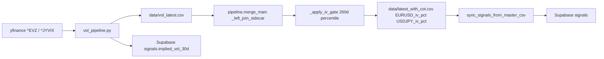

# CBOE FX Vol Swap — replace CME CVOL with ^EVZ / ^JYVIX

## Why this is safe

Only `vol_pipeline.py` changes. The sidecar CSV schema stays `(date, pair, implied_vol_30d, vol_skew, atm_vol)`, so:

- [pipeline.py](pipeline.py) `_left_join_sidecar` still produces `EURUSD_implied_vol_30d` / `USDJPY_implied_vol_30d` master columns.
- [pipeline.py](pipeline.py) `_apply_iv_gate` still computes 260d `iv_pct` and applies the 0.2 / 0.7 / 1.0 multiplier + `VOL_EXPANDING` label.
- [core/signal_write.py](core/signal_write.py) `_row_to_signal` still writes `implied_vol_30d` to Supabase `signals`.
- `vol_skew` and `atm_vol` are written as NULL (NaN) — `_row_to_signal` already filters out NaN before upsert, so Supabase rows simply won't include those keys.

## Data flow (unchanged structurally)



## File changes

### 1. [vol_pipeline.py](vol_pipeline.py) — full rewrite

Replace the CME REST fetch with yfinance pulls. Keep the sidecar schema and Supabase upsert shape identical.

- Drop imports: `requests`, `datetime.timedelta`, `CME_CVOL_BASE`, `CME_CVOL_PRODUCTS`.
- Add import: `from core.utils import _yf_safe_download` (already exists, already wraps `yf.download` with timeout + `pipeline_errors` logging).
- Remove `CME_API_KEY` read entirely. No env var gate.
- New constant: `CBOE_VOL_TICKERS = {"EURUSD": "^EVZ", "USDJPY": "^JYVIX"}`.
- Replace `_fetch_cvol(pair, product, api_key)` with `_fetch_cboe_vol(pair, ticker)`:
  - Calls `_yf_safe_download(ticker, start=START_DATE, interval="1d", auto_adjust=True)`.
  - Handles yfinance multi-index columns (same pattern used in [pipeline.py](pipeline.py) merge_main's VIX fetch).
  - Uses `Close` as `implied_vol_30d` (CBOE publishes vols as index values, e.g. 7.5 = 7.5 vol points).
  - Writes NaN for `vol_skew` and `atm_vol`.
  - Normalises to `(date, pair, implied_vol_30d, vol_skew, atm_vol)`.
- Emit a **one-time** per-run `pipeline_errors` row flagging the loss of skew/atm fields: `log_pipeline_error("vol_pipeline", "CBOE ^EVZ/^JYVIX provides headline IV only; vol_skew and atm_vol set NULL", notes="cboe_downgrade")`. Logged once per run (not per pair) to avoid noise.
- Rewrite `main()`:
  - Loop over `CBOE_VOL_TICKERS`, concat frames.
  - If all frames empty → write empty sidecar, return (same as today).
  - Otherwise write `data/vol_latest.csv`, call `_upsert_signals(out)`, done.
- Docstring update: "Phase 3 — CBOE FX implied-vol indices (^EVZ, ^JYVIX) via yfinance. USD/INR has no listed CBOE product, stays NULL."

### 2. [config.py](config.py) — minor cleanup (optional but tidy)

Keep `CME_CVOL_BASE` and `CME_CVOL_PRODUCTS` for now as dead code to avoid touching any other importer. Do **not** delete. Add one new block:

```python
# CBOE FX vol indices (free, via yfinance) — Phase 3 CVOL replacement
CBOE_VOL_TICKERS = {
    "EURUSD": "^EVZ",   # CBOE EuroCurrency Volatility Index (30-day IV)
    "USDJPY": "^JYVIX", # CBOE/CME Yen Volatility Index (30-day IV)
}
```

Keeping `CME_*` constants avoids any surprise `ImportError` in case some dev/test script imports them; they will be pruned in a later sweep.

### 3. No changes needed in

- [pipeline.py](pipeline.py) — `_apply_iv_gate` reads `{pair}_implied_vol_30d` (unchanged column).
- [core/signal_write.py](core/signal_write.py) — `_row_to_signal` already filters NaN before upsert, so Supabase will just skip `vol_skew` / `atm_vol` keys.
- [run.py](run.py) `STEPS` — order and script name unchanged.
- [requirements.txt](requirements.txt) — yfinance already pinned.

## Verification (post-edit, agent mode)

1. `python vol_pipeline.py` — expect a non-empty `data/vol_latest.csv` with two pairs, `implied_vol_30d` populated, `vol_skew` / `atm_vol` empty.
2. `python -c "from pipeline import merge_main; merge_main()"` — expect `EURUSD_implied_vol_30d`, `USDJPY_implied_vol_30d`, `EURUSD_iv_pct`, `USDJPY_iv_pct` columns present in `data/latest_with_cot.csv`.
3. Spot-check one Supabase `signals` row for EURUSD today: `implied_vol_30d` present, `vol_skew` / `atm_vol` absent (or NULL).
4. One `pipeline_errors` row with `source='vol_pipeline'` and `notes='cboe_downgrade'`.

## Deploy

After verification:
1. `git add vol_pipeline.py config.py`
2. Commit message: `feat(vol): swap CME CVOL for free CBOE ^EVZ / ^JYVIX via yfinance`
3. `git push` to current branch.
4. Report the resulting commit SHA (short form) as the "version ID".

## Rollback

Single `git revert <sha>`. Because `vol_latest.csv` schema is identical, the first post-revert run of `vol_pipeline.py` will restore the prior (CME CVOL) shape — no data migration needed. `merge_main` is NaN-safe either way.

## Caveats to flag in the deploy comment

- ^JYVIX history starts ~2013; ^EVZ ~2008. The 260-day `iv_pct` window is unaffected.
- CBOE posts these at NY EOD; yfinance typically has T-0 available the next morning, matching the existing pipeline cadence.
- Because skew is now NULL, the `vol_skew` slice of `primary_driver` will always contribute 0 until a skew source is added. This is the intended temporary trade-off.