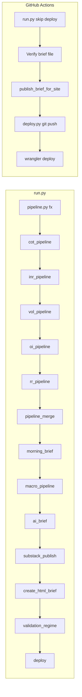

# End-to-end pipeline audit plan

## Scope and truth source

- **Orchestrator:** [`run.py`](c:\Market Journey 2026\Code\fx_regime\run.py) — canonical step order: `fx` → `cot` → `inr` → `vol` → `oi` → `rr` → `merge` → `text` → `macro` → `ai` → `substack` → `html` → `validate` → `deploy`.
- **CI:** [`.github/workflows/daily_brief.yml`](c:\Market Journey 2026\Code\fx_regime\.github\workflows\daily_brief.yml) runs `python run.py --skip deploy`, then verify brief, `publish_brief_for_site.py`, `deploy.py`, then `wrangler deploy`.
- **Do not treat** [`contaxt files/CONTEXT.md`](c:\Market Journey 2026\Code\fx_regime\contaxt%20files\CONTEXT.md) section 62–66 as the live step list without reconciling to `run.py` (it omits `vol`/`oi`/`rr`/`merge` wrapper/`substack`/`validate`).

---

## Phase 1 — Inventory and contract check (read-only)

| Area | What to verify | Primary artifacts |
|------|-----------------|---------------------|
| Step contracts | Each step’s inputs (CSV/JSON), outputs, and whether failure is visible to the parent process | Docstrings in each `*_pipeline.py`, [`morning_brief.py`](c:\Market Journey 2026\Code\fx_regime\morning_brief.py), [`create_html_brief.py`](c:\Market Journey 2026\Code\fx_regime\create_html_brief.py), [`scripts/pipeline_merge.py`](c:\Market Journey 2026\Code\fx_regime\scripts\pipeline_merge.py) |
| Non-blocking semantics | `NON_BLOCKING_STEPS` in `run.py` vs actual need for production | [`run.py`](c:\Market Journey 2026\Code\fx_regime\run.py) lines 93–96, 216–220 |
| Exit codes | Which scripts always `sys.exit(0)` even on error | e.g. [`vol_pipeline.py`](c:\Market Journey 2026\Code\fx_regime\vol_pipeline.py), [`oi_pipeline.py`](c:\Market Journey 2026\Code\fx_regime\oi_pipeline.py), [`rr_pipeline.py`](c:\Market Journey 2026\Code\fx_regime\rr_pipeline.py) (all end with `sys.exit(0)` after try/except); [`scripts/pipeline_merge.py`](c:\Market Journey 2026\Code\fx_regime\scripts\pipeline_merge.py) (`sys.exit(0)` unconditionally) |
| Merge behavior | `merge_main()` documents “never raises” and can return early | [`pipeline.py`](c:\Market Journey 2026\Code\fx_regime\pipeline.py) `merge_main` |
| Status surface | What the dashboard sees after a run | [`core/pipeline_status.py`](c:\Market Journey 2026\Code\fx_regime\core\pipeline_status.py), sidecar from [`core/signal_write.py`](c:\Market Journey 2026\Code\fx_regime\core\signal_write.py) |
| Errors table | When rows appear / gaps | `log_pipeline_error` in [`core/signal_write.py`](c:\Market Journey 2026\Code\fx_regime\core\signal_write.py) |

**Deliverable:** a one-page “contract matrix” (step × inputs × outputs × exit-on-failure × where errors are logged).

---

## Phase 2 — Runtime audit (local and CI)

1. **Local full run (or `--only` slices):** `python run.py` with a valid `.env`; capture `runs/<date>/pipeline.log` and confirm each step’s stdout claims match files on disk (`data/*.csv`, `briefs/brief_*.html`, `charts/*.html`, [`site/data/pipeline_status.json`](c:\Market Journey 2026\Code\fx_regime\core\paths.py) if written).
2. **Failure injection (optional):** temporarily break one upstream input (e.g. rename expected CSV) and observe whether `run.py` stops, continues, and whether `pipeline_errors` / logs reflect the issue—especially for **merge** and **layer-3** steps that may degrade silently.
3. **CI replay:** for the last N workflow runs, check: first vs second attempt in the workflow, `concurrency: cancel-in-progress` impact on partial runs, and whether verify step date (`date -u +%Y%m%d`) matches UTC expectations vs brief naming in [`create_html_brief.py`](c:\Market Journey 2026\Code\fx_regime\create_html_brief.py) / `config.TODAY`.
4. **Deploy path:** trace [`deploy.py`](c:\Market Journey 2026\Code\fx_regime\deploy.py): fallback to “most recent” brief when today’s file missing (risk: publishing stale brief without failing the job); `return` without `sys.exit(1)` on some error branches (process may still exit 0—worth confirming in audit).
5. **Cloudflare:** confirm `wrangler deploy` success is independent of git push; document secret requirements (`CLOUDFLARE_*`) vs GitHub Pages.

**Deliverable:** short “runtime findings” list with severity (P0–P3).

---

## Phase 3 — Data quality and consistency

- **Master / merge:** After `merge`, validate row count, latest date, and presence of sidecar columns from `vol_latest.csv` / `oi_latest.csv` / `rr_latest.csv` vs merge logic in `merge_main` (left joins and gates).
- **Supabase (if configured):** compare latest `signals` rows to CSV master for same `(date, pair)`; check `pipeline_errors` for spikes by `source`; confirm sidecar fields in `pipeline_status.json` (`supabase_write_status`, row counts) match expectations from [`_write_supabase_sidecar`](c:\Market Journey 2026\Code\fx_regime\core\signal_write.py).
- **Brief vs data:** Run existing QA scripts from [`scripts/dev/`](c:\Market Journey 2026\Code\fx_regime\scripts\dev) (e.g. stress/verify scripts mentioned in [`AGENTS.md`](c:\Market Journey 2026\Code\fx_regime\AGENTS.md)) against the latest HTML brief—no new dependencies.

**Deliverable:** checklist of “signals present in brief” vs “signals in merge output.”

---

## Phase 4 — Security and ops

- **Secrets:** `.env` assembly in workflow only; no keys in repo; service role key scope (server-side only).
- **Git:** `deploy.py` rebase/merge strategy—document when human intervention is still needed.
- **Third-party fragility:** FRED, yfinance, CFTC, CME scrapes/APIs—map each to try/except and fallback behavior (per project rules).

---

## Known negatives / bugs / risks (audit should confirm and prioritize)

| Issue | Why it hurts | How to fix (direction) |
|-------|----------------|------------------------|
| **Docs out of sync** | Operators follow wrong step order or miss layers | Update `CONTEXT.md` / `AGENTS.md` / any internal copy to match `run.py` STEPS exactly |
| **Always `sys.exit(0)` on vol/oi/rr** | Orchestrator cannot fail the run on empty or bad IV/OI/RR data; failures only in logs / `pipeline_errors` | Decide policy: either propagate non-zero exit on “hard fail” thresholds, or treat as non-blocking steps in `run.py` and document “soft success” |
| **`merge_main` never raises; early `return` if CSV missing** | Downstream brief may run on stale or partial master while step prints “skip” | Return distinct exit code from merge wrapper, or write explicit `pipeline_errors` + fail `merge` in CI when required inputs missing |
| **`scripts/pipeline_merge.py` always exits 0** | Same as above—even exceptions in wrapper exit success | Exit non-zero on exception; align with `merge_main` success criteria |
| **`deploy.py` `return` on fatal paths** | CI may report green while nothing was deployed | Use `sys.exit(1)` (or raise) for “no brief” / corrupted HTML |
| **Deploy “latest brief” fallback** | Risk of shipping wrong day’s brief | Fail if `brief_YYYYMMDD.html` missing when `TODAY` expects it, or gate fallback behind env flag |
| **`log_pipeline_error` no-op without Supabase client** | Local/CI runs without keys lose centralized error visibility | stderr + file-based error log or optional local JSONL sink |
| **Workflow retry without explicit success flag** | Second attempt may mask systemic failure | Log both attempts; alert if both fail |
| **Concurrency cancel-in-progress** | Overlapping runs can cancel mid-flight | Document or adjust concurrency for deploy safety |
| **PLAN “snapshot” vs repo reality** | Mismatched expectations (e.g. Supabase “none” vs dual-write code) | Refresh snapshot in [`contaxt files/PLAN.md`](c:\Market Journey 2026\Code\fx_regime\contaxt%20files\PLAN.md) from actual code state |

---

## Phase 5 — Reporting and remediation backlog

1. Produce a **single audit report** (repo root or agreed location—your choice when implementing; avoid `_docs/` per project rules).
2. Backlog items: each finding → owner, severity, suggested code/test change, verification command.
3. Add **regression tests** only where high value: e.g. assert `deploy.py` exits non-zero on missing brief in CI mode; or a dry-run script that validates file presence after each step (no new deps).

---

## Success criteria for the audit

- Contract matrix complete for all `run.py` steps + CI steps after `run.py`.
- Every **silent success** path (exit 0 with degraded data) is explicitly listed with a product decision (acceptable vs must-fix).
- Supabase / CSV / brief **triple consistency** checked for at least one recent production date.
- Documentation references **one** canonical sequence: `run.py` STEPS.
