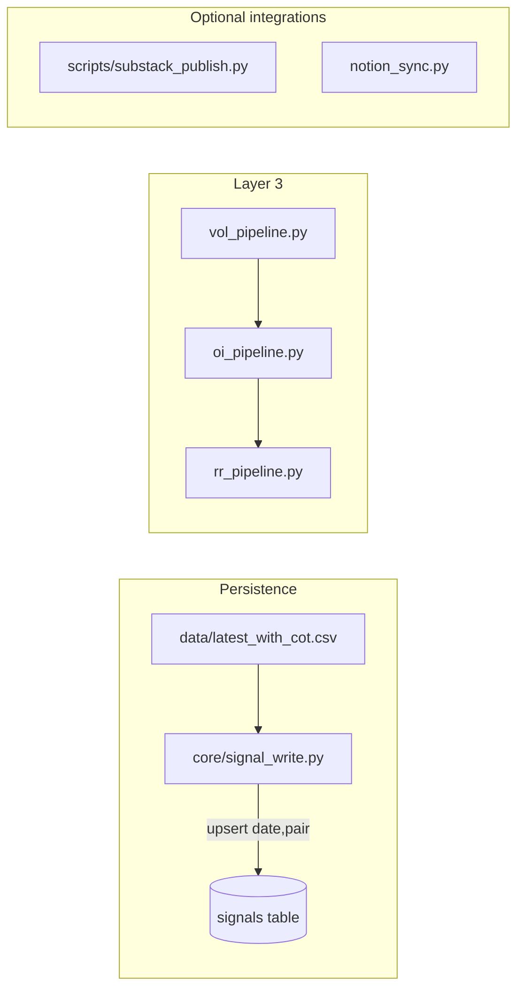

# Plan: Fix persisted pipeline problems

This plan addresses the issues observed on the last local [`run.py`](run.py) run: **Supabase upserts failing on `signals.spot`**, **OI empty within the lookback window**, **RR wing interpolation returning null**, **Substack 401**, **Notion 404**, and **verification script false failures** (plus the **Windows/console Unicode** risk in [`macro_pipeline.py`](macro_pipeline.py) if `PYTHONUTF8` is not set).

---

## 1. Supabase `signals` — missing `spot` column (PGRST204)

**Root cause:** [`core/signal_write.py`](core/signal_write.py) `_row_to_signal()` always sets `out["spot"]` from `EURUSD` / `USDJPY` / `USDINR` (lines 103–124). PostgREST rejects payloads that reference columns not present in the exposed schema.

**Manual (you):**

1. In **Supabase Dashboard → SQL Editor** (or use the Supabase MCP **`apply_migration`** / **`execute_sql`** as documented in [`docs/SUPABASE_SETUP.md`](docs/SUPABASE_SETUP.md)), run:
   - `ALTER TABLE public.signals ADD COLUMN IF NOT EXISTS spot double precision;`
2. **Column audit (recommended once):** Compare all keys emitted by `_row_to_signal()` plus Layer 3 writers ([`vol_pipeline.py`](vol_pipeline.py), [`oi_pipeline.py`](oi_pipeline.py), [`rr_pipeline.py`](rr_pipeline.py)) against `information_schema.columns` for `public.signals`. Add any other missing columns the same way (e.g. `implied_vol_30d`, `oi_delta`, `risk_reversal_25d`, etc.) so the next failure is not whack-a-mole.
3. If errors persist after DDL, **reload PostgREST schema cache** (Supabase often picks up new columns automatically; if not, use **Settings → API → Reload schema** or restart per project docs).
4. Confirm **`UNIQUE (date, pair)`** (or equivalent) exists so upserts with `on_conflict="date,pair"` match [`.cursor/skills/fx-regime-supabase-writes/SKILL.md`](.cursor/skills/fx-regime-supabase-writes/SKILL.md) expectations.

**After DDL (agent / you):**

- Run a one-off backfill so DB matches CSV history: [`scripts/backfill_supabase.py`](scripts/backfill_supabase.py) or [`scripts/dev/backfill_signals.py`](scripts/dev/backfill_signals.py) with `.env` loaded, or trigger `sync_all_signals_from_master_csv()` via pipeline `--only` steps that call it ([`cot_pipeline.py`](cot_pipeline.py), [`inr_pipeline.py`](inr_pipeline.py), [`pipeline.py`](pipeline.py) merge path).

**Doc update (small, optional):** Add a short “`signals` column checklist” subsection to [`docs/SUPABASE_SETUP.md`](docs/SUPABASE_SETUP.md) or [`docs/PIPELINE_AUDIT_AND_OPERATIONS.md`](docs/PIPELINE_AUDIT_AND_OPERATIONS.md) so future DDL stays in sync with Python.

---

## 2. OI pipeline — “no OI report within T+2 window”

**Root cause:** [`oi_pipeline.py`](oi_pipeline.py) `main()` loops `lag in (0, 1, 2)` on **calendar** dates and skips weekends entirely (lines 197–208). CME publication can lag; **three calendar attempts may not cover enough business days** around weekends/holidays.

**Code changes (no new dependencies):**

- Extend the search to **more business days** (e.g. 5–10 calendar days) or iterate **last N trading days** explicitly (Mon–Fri only, skip US holidays optionally later).
- When all attempts fail, **log the HTTP status and first line of the response** (already partially there) to distinguish “empty report” vs **URL/params change** vs **rate limit**.
- Optional: if `raw` empty, try **previous week’s last known good** pattern from [`config.py`](config.py) `CME_OI_URL` / `CME_OI_PRODUCT_IDS` verification.

**Manual (you):** Spot-check one failing day in a browser or `curl` with the same `tradeDate` / `productIds` to confirm CME still serves CSV for 6E/6J.

---

## 3. RR pipeline — `wing interpolation failed (call=None, put=None)`

**Root cause:** [`rr_pipeline.py`](rr_pipeline.py) `_interp_iv_at_delta` may not find strikes whose BS delta is near ±0.25 for the chosen expiry; **yfinance** chains can be sparse or missing IV.

**Code changes (scipy already allowed):**

- **Fallback expiry:** If the 20–45d expiry fails, try the **next nearest** expiry outside the band (e.g. 10–60d) before giving up.
- **Relax target delta:** Interpolate toward **0.20–0.30** if 0.25 fails (min error in delta space).
- **Fallback metric:** If still null, optionally set RR from **ATM call IV − ATM put IV** (less ideal but better than empty `rr_latest.csv`).
- Emit **one structured `log_pipeline_error`** with row counts for calls/puts and chosen expiry to speed up future triage.

**Manual:** None unless you switch data source (would need explicit approval for new dependencies or paid APIs).

---

## 4. Substack — HTTP 401

**Root cause:** [`scripts/substack_publish.py`](scripts/substack_publish.py) (or its auth) rejects credentials; **non-blocking** in [`run.py`](run.py) `NON_BLOCKING_STEPS`.

**Manual (you):**

- Add/update **GitHub Actions secrets** and local `.env` with the correct Substack session/email/password or token variables the script expects (inspect script header for exact env names).
- Treat as **optional**: pipeline success does not require Substack.

---

## 5. Notion — 404 on `blocks/{HOME_DASHBOARD_PAGE_ID}/children`

**Root cause:** [`notion_sync.py`](notion_sync.py) hardcodes `HOME_DASHBOARD_PAGE_ID = "31f4fe96a7b581a9bdbec459bd27f224"` (line 41). A **404** means the ID is wrong, the page was deleted, or the **integration** is not **shared** with that page/database.

**Manual (you):**

- In Notion: confirm the **Home Dashboard** page exists; **Share → Invite** the integration.
- Replace the ID with the **current page ID** (from Notion URL or “Copy link”).

**Code improvement (recommended):**

- Read `HOME_DASHBOARD_PAGE_ID` from `os.environ` with fallback to the constant, so you can rotate IDs without code edits (still requires your approval to implement).

**Non-blocking:** [`run.py`](run.py) runs Notion after success; failures should not fail the pipeline (verify current behavior matches intent).

---

## 6. Verification scripts — false FAIL on Phase 3 HTML

**Root cause:** [`scripts/dev/verify_html.py`](scripts/dev/verify_html.py) looks for `EURUSD_corr_20d` / `USDJPY_corr_20d` strings, but [`create_html_brief.py`](create_html_brief.py) `_corr_row_20d` does **not** add `data-field` attributes (lines 200–205). [`scripts/dev/verify_full.py`](scripts/dev/verify_full.py) uses **hardcoded** `-0.223` and `+0.150` (lines 42–43) which will always drift.

**Code changes:**

- **verify_html:** Assert `20D Corr` appears in each pair card section, or assert formatted values from `latest` CSV (`f'{EURUSD_corr_20d:+.3f}'` etc.).
- **verify_full:** Replace hardcoded substrings with values derived from `latest` (same as CSV section).
- Optionally **add `data-field`** to `_corr_row_20d` in `create_html_brief.py` for consistency with `_field_row` — **either** fix tests **or** template; not both unless you want redundancy.

---

## 7. Windows / macro print — UnicodeEncodeError (cp1252)

**Root cause:** [`macro_pipeline.py`](macro_pipeline.py) prints Unicode arrow `→` (seen in earlier run when `PYTHONUTF8` was unset).

**Code change:** Replace that character with ASCII `->` in the `print`, or rely on `PYTHONUTF8=1` in CI (document in [`docs/LOCAL_DEV.md`](docs/LOCAL_DEV.md)).

---

## Suggested implementation order

1. **Supabase DDL + backfill** (unblocks all `signals` upserts).
2. **Verification scripts** (quick win, restores trust in local QA).
3. **OI lookback + RR fallbacks** (reduces empty Layer 3 sidecars).
4. **Notion env-based page ID + Substack secrets** (operator-only).
5. **macro print** one-liner if Windows remains an issue.

---

## What you must do manually (before implementation approval)

| Item | Action |
|------|--------|
| `signals.spot` | Approve running **`ALTER TABLE ... ADD COLUMN spot`** in Supabase (or MCP migration). |
| Column audit | Optionally export full `signals` table list from Supabase and compare to `_row_to_signal` + vol/oi/rr payloads. |
| Notion | Share page with integration + confirm **page ID**; approve env var for ID if we add it. |
| Substack | Add secrets to GitHub + local `.env` if you want drafts. |

**Ask before implementation:** Confirm you approve **adding `spot` (and any other missing columns found in audit)** in Supabase, and whether **Notion page ID** should move to **environment variable** only (no hardcoded fallback) or **env + fallback**.
