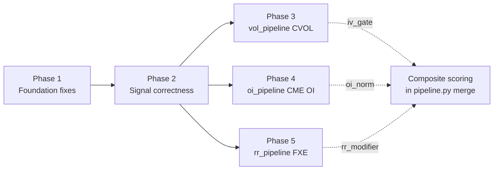

# FX Regime Lab — Layer 3 Signal Stack: Phases 1–5

**Session deliverable stated up front:** this plan builds the full Layer 3 signal stack. Writes land in Supabase `signals` (new columns already in DDL per [contaxt files/PLAN.md](contaxt%20files/PLAN.md) `implied_vol_30d`, `vol_skew`, `atm_vol`, `risk_reversal_25d`, `oi_delta`, `oi_price_alignment`, `realized_vol_5d`, `cross_asset_vix`, `rate_diff_zscore`, `cot_percentile`), and `regime_calls.primary_driver`. Orchestrated by existing [run.py](run.py) `STEPS`: `fx → cot → inr → vol → oi → rr → merge → text → macro → ai → substack → html → validate → deploy`. Canonical order is **NOT** changed.

**Global constraints re-stated:**
- Every API call wrapped in try/except; steps must `return` cleanly on failure (never raise into [run.py](run.py)). `vol`, `oi`, `rr` remain **blocking** only because they already are in `STEPS`; we preserve that by having `main()` always `sys.exit(0)`, logging to `pipeline_errors`.
- Every Supabase write: `upsert(on_conflict='date,pair')` via `core.supabase_client.get_client()` (returns `None` → skip + CSV fallback).
- CSV fallback path per module: `data/{vol,oi,rr}_latest.csv`.
- No new pip dependencies. Uses existing `requests`, `pandas`, `numpy`, `yfinance`, `scipy`, `supabase-py`.

---

## Cross-phase dependency graph



P3/P4/P5 are independent of each other once P1+P2 are in; they may ship in any order, but the composite wiring (iv_gate, oi_norm, rr_modifier) is authored inside each phase so that partial rollouts degrade gracefully (missing column → weight redistribution collapses that slice to 0).

---

## PHASE 1 — Foundation fixes

### Summary
Fix structural bugs that silently drop Layer-3 signals from the master merge and from `signals`/`regime_calls`. Without this phase, every new signal added later is invisible to the morning brief.

### Files to create or modify
- [run.py](run.py) — deduplication filter on line ~205 (`if script in seen_scripts`) makes the `merge` step a no-op because `fx` already ran `pipeline.py`. Split `merge` into its own entry point.
- [pipeline.py](pipeline.py) — new idempotent `merge_main()` that re-reads `data/latest.csv` + every `data/{cot,inr,vol,oi,rr}_latest.csv`, rebuilds `data/latest_with_cot.csv`, computes `EURUSD_vol5 / USDJPY_vol5 / USDINR_vol5`, fetches and writes `VIX` column, and recomputes **`primary_driver` per pair** from signal contributions.
- [cot_pipeline.py](cot_pipeline.py) lines 201, 213 — replace `rank(pct=True)` with 52-week rolling-window rank.
- [core/signal_write.py](core/signal_write.py) — already reads `*_vol5` and `VIX` (lines 115–117, 136–138); no change needed once columns exist.
- [core/regime_persist.py](core/regime_persist.py) lines 125, 137, 149 — replace the hardcoded `"eurusd_composite"` / `"usdjpy_composite"` / `"inr_composite"` strings with the driver string computed in `pipeline.merge_main()` and stored on the row.
- [config.py](config.py) — add `VIX_TICKER = "^VIX"`.
- `scripts/pipeline_merge.py` **(new, 6 lines)** — thin wrapper: `from pipeline import merge_main; merge_main()`.

### Critical code changes (pseudocode)

**Unblock the merge step** — [run.py](run.py) line 79:
```python
STEPS = [
    ...
    ("rr",    "rr_pipeline.py"),
    ("merge", "scripts/pipeline_merge.py"),   # was pipeline.py → was dedup'd away
    ("text",  "morning_brief.py"),
    ...
]
```
Do NOT touch the `seen_scripts` block; once the script name differs, dedup is inert and [run.py](run.py) behavior for every other step is unchanged.

**`pipeline.merge_main()`** — new function appended to [pipeline.py](pipeline.py), runs after all layer modules:
```python
def merge_main():
    m = pd.read_csv(LATEST_WITH_COT_CSV, index_col=0, parse_dates=True)

    # realized_vol_5d (annualised, log-returns, window=5)
    for pair in ("EURUSD","USDJPY","USDINR"):
        if pair in m.columns:
            lr = np.log(m[pair] / m[pair].shift(1))
            m[f"{pair}_vol5"] = lr.rolling(5).std() * np.sqrt(252) * 100

    # cross_asset_vix — fetch once, try/except, ffill(5)
    try:
        vix = yf.download("^VIX", start=START_DATE, end=TODAY,
                          progress=False, timeout=30)["Close"]
        vix.index = pd.to_datetime(vix.index.date)
        m["VIX"] = vix.reindex(m.index).ffill(limit=5)
    except Exception as e:
        log_pipeline_error("merge_main", f"VIX fetch: {e}", notes="vix")

    # rate_diff_zscore = 5d-change z-score, 60d trailing
    for prefix in ("US_DE_2Y_spread","US_DE_10Y_spread",
                   "US_JP_2Y_spread","US_JP_10Y_spread",
                   "US_IN_policy_spread","US_IN_10Y_spread"):
        if prefix in m.columns:
            chg5 = m[prefix].diff(5)
            mu   = chg5.rolling(60, min_periods=20).mean()
            sd   = chg5.rolling(60, min_periods=20).std().replace(0, np.nan)
            m[f"{prefix}_zscore"] = ((chg5 - mu) / sd).clip(-3, 3)

    # merge vol/oi/rr latest CSVs into master (left-join on date,pair)
    for csv in ("vol_latest.csv","oi_latest.csv","rr_latest.csv"):
        _left_join_by_pair(m, DATA_DIR / csv)

    # primary_driver — per pair, from normalised contributions
    m = _compute_primary_driver(m)

    m.to_csv(LATEST_WITH_COT_CSV)
    sync_all_signals_from_master_csv()
```

**`_compute_primary_driver`** — replaces the hardcoded stub:
```python
def _compute_primary_driver(m):
    for pair, prefix in [("eur","US_DE_10Y"),("jpy","US_JP_10Y"),("inr","US_IN_10Y")]:
        contribs = {
            "rate":  abs(m.get(f"{prefix}_spread_zscore", 0)) * 0.30,
            "cot":   abs(m.get(f"{PAIR_COT[pair]}_lev_percentile", 0) - 50) / 50 * 0.25,
            "vol_skew": abs(m.get(f"{PAIR_ID[pair]}_vol_skew", 0)) * 0.15,
            "rr":    abs(m.get(f"{PAIR_ID[pair]}_rr_z", 0)) * 0.15,
            "oi":    (m.get(f"{PAIR_ID[pair]}_oi_align_score", 0)) * 0.15,
        }
        # latest row only
        row_contribs = {k: float(v.iloc[-1]) if hasattr(v,"iloc") else 0.0
                        for k,v in contribs.items()}
        top = max(row_contribs, key=row_contribs.get)
        m.at[m.index[-1], f"{pair}_primary_driver"] = f"{top}:{row_contribs[top]:.2f}"
    return m
```
Then [core/regime_persist.py](core/regime_persist.py) passes `row.get(f"{pair_lower}_primary_driver", "unknown")` instead of the literal.

**COT 52-week rolling percentile** — [cot_pipeline.py](cot_pipeline.py):
```python
# was: df["lev_percentile"] = df["lev_net"].rank(pct=True) * 100
df["lev_percentile"] = (
    df["lev_net"].rolling(window=52, min_periods=26).rank(pct=True) * 100
)
df["assetmgr_percentile"] = (
    df["assetmgr_net"].rolling(window=52, min_periods=26).rank(pct=True) * 100
)
```
`rolling(...).rank(pct=True)` is available in pandas ≥ 1.4 (already pinned in `requirements.txt`).

### Verification
```powershell
python run.py --only fx cot inr merge
python -c "import pandas as pd; df=pd.read_csv('data/latest_with_cot.csv',index_col=0); print(df[['EURUSD_vol5','USDJPY_vol5','USDINR_vol5','VIX','US_DE_10Y_spread_zscore','EUR_lev_percentile','eur_primary_driver']].tail(3))"
```
All seven columns must be populated and non-NaN for the latest trading day. Then `python scripts/dev/terminal_data_smoke.py` must show `realized_vol_5d`, `cross_asset_vix`, `rate_diff_zscore` non-null in Supabase `signals`.

### Rollback
`git revert` the commit. The `merge` step reverts to its current no-op state; vol/oi/rr are still stubs → pipeline behavior returns to pre-phase. No Supabase schema change, so rollback is pure-code.

### Dependencies
None. Must complete before Phase 2.

---

## PHASE 2 — Signal correctness

### Summary
Fix the four correctness bugs that survive even after Phase 1: rate-diff window semantics (Phase 1 already moved to 5d, Phase 2 hardens it and back-fills the `_chg_1D` vs `_chg_5D` naming used by consumers), brief text cleaning before Supabase, AI brief input source, and yfinance hardening.

### Files to modify
- [core/regime_persist.py](core/regime_persist.py) line 168 — run `_clean_brief_text` before `brief_log` upsert.
- `core/utils.py` — add `_clean_brief_text()` (Python port of the JS in [site/terminal/data-client.js](site/terminal/data-client.js) `cleanBriefText`, lines 1186–1260).
- [ai_brief.py](ai_brief.py) — load `briefs/brief_{slug}.txt` as primary prompt context; keep the CSV pull only as structured-data augmentation, not as the source-of-truth narrative.
- [pipeline.py](pipeline.py) `fetch_fx_data`, `fetch_commodity_data`, `merge_main` (VIX), [inr_pipeline.py](inr_pipeline.py) `fetch_usdinr_price`, [rr_pipeline.py](rr_pipeline.py), [validation_regime.py](validation_regime.py) — wrap every `yf.download` / `yf.Ticker` in `try/except` with `timeout=30`.
- [core/regime_persist.py](core/regime_persist.py) `_rate_signal` lines 39–46 — switch from `US_DE_2Y_spread_chg_1D` → `US_DE_2Y_spread_chg_5D` (produced by Phase 1) so the sign agrees with the 5d z-score used in composite.

### Critical code changes (pseudocode)

**Brief cleaning**, `core/utils.py`:
```python
import re
_MD_RE  = re.compile(r"(\*\*|\*|_{1,2}|`|~~)")
_HEAD_RE = re.compile(r"^#{1,6}\s*", flags=re.MULTILINE)
_LINK_RE = re.compile(r"\[([^\]]+)\]\([^)]+\)")

def _clean_brief_text(raw: str) -> str:
    if not raw: return ""
    t = raw.replace("\r\n","\n").replace("\r","\n")
    t = _LINK_RE.sub(r"\1", t)
    t = _HEAD_RE.sub("", t)
    t = _MD_RE.sub("", t)
    t = re.sub(r"\n{3,}", "\n\n", t)
    return t.strip()
```

[core/regime_persist.py](core/regime_persist.py) line 168:
```python
from core.utils import _clean_brief_text
...
brief_stub = {
    "date": TODAY,
    "brief_text": (_clean_brief_text(brief_text)[:10000] if brief_text else None),
    ...
}
```

**AI brief consumes morning brief text** — [ai_brief.py](ai_brief.py):
```python
def _load_morning_brief() -> str:
    path = BRIEFS_DIR / f"brief_{TODAY.replace('-','')}.txt"
    try:
        return path.read_text(encoding="utf-8") if path.exists() else ""
    except OSError:
        return ""
```
Prepend to the Claude prompt as `primary source`, use CSV-derived stats only as supporting numeric context. Remove the duplicate signal-rebuilding path for narrative generation (keep it only for the structured `ai_article.json` fields).

**yfinance hardening** pattern — apply everywhere a raw `yf.download` exists:
```python
def _yf_safe_download(tickers, **kw):
    kw.setdefault("timeout", 30)
    kw.setdefault("progress", False)
    try:
        df = yf.download(tickers, **kw)
        return df if df is not None and not df.empty else pd.DataFrame()
    except Exception as e:
        log_pipeline_error("yfinance", f"{tickers}: {e}", notes="safe_download")
        return pd.DataFrame()
```
`_yf_safe_download` lives in `core/utils.py`. All 6 call sites (pipeline.py:96, 131, 167; inr_pipeline.py:57; rr_pipeline.py:35; validation_regime.py:104) switch to it. **Pipeline never raises**; empty frame degrades gracefully in each module's existing NaN paths.

### Verification
```powershell
python run.py --only fx cot inr merge text ai
python -c "from core.utils import _clean_brief_text; assert _clean_brief_text('**bold** [x](y)\n## H') == 'bold x\nH'"
```
Then query Supabase: `select brief_text from brief_log order by date desc limit 1` must contain zero `*`, zero `#`, zero `[...]()` patterns. `ai_article.json` `narrative` field must textually reference the morning brief's macro context sentence.

### Rollback
Per-file `git revert`. The four changes are independent; revert only the offending one. `_clean_brief_text` has no schema cost.

### Dependencies
Phase 1 complete (needs `*_vol5`, `VIX`, `*_spread_zscore`, `*_primary_driver` columns to exist before `regime_persist` reads them).

---

## PHASE 3 — `vol_pipeline.py` (CME CVOL)

### Summary
Replace the [vol_pipeline.py](vol_pipeline.py) stub (currently 40 lines, only logs env-var presence) with the full CME CVOL EOD REST integration specified. Writes `implied_vol_30d`, `vol_skew`, `atm_vol` to Supabase, computes 260-day IV percentile, and introduces the `iv_gate` multiplier into the composite scoring.

### Files to create or modify
- [vol_pipeline.py](vol_pipeline.py) — full rewrite.
- [config.py](config.py) — add `CME_CVOL_BASE = "https://www.cmegroup.com/CmeWS/mvc/CVOL/index"`, `CME_PRODUCTS = {"EURUSD": "EURUSD_CVOL", "USDJPY": "USDJPY_CVOL"}`.
- [core/signal_write.py](core/signal_write.py) `_row_to_signal` — add `implied_vol_30d`, `vol_skew`, `atm_vol`, `iv_pct` reads (master columns written by Phase 3).
- [pipeline.py](pipeline.py) `merge_main` — join `data/vol_latest.csv` and compute per-pair `iv_pct = rolling(260, min_periods=60).rank(pct=True)`, apply `iv_gate` to `{pair}_composite_score` and override label to `VOL_EXPANDING` when `iv_pct > 0.90`.

### Critical code changes (pseudocode)

```python
# vol_pipeline.py
def _fetch_cvol(product: str) -> pd.DataFrame:
    key = os.environ.get("CME_API_KEY")
    if not key:
        return pd.DataFrame()
    end = datetime.today().strftime("%Y%m%d")
    start = (datetime.today() - timedelta(days=365)).strftime("%Y%m%d")
    url = f"{CME_CVOL_BASE}/{product}/{start}/{end}"
    try:
        r = requests.get(url, headers={"Authorization": f"Bearer {key}"}, timeout=30)
        r.raise_for_status()
        js = r.json()
        return pd.DataFrame(js["data"])  # columns: date, cvol, atm_vol, up_var, dn_var, skew
    except Exception as e:
        log_pipeline_error("vol_pipeline", f"{product}: {e}", pair=product[:6])
        return pd.DataFrame()

def main():
    frames = []
    for pair, product in CME_PRODUCTS.items():
        df = _fetch_cvol(product)
        if df.empty: continue
        df["pair"] = pair
        df["implied_vol_30d"] = df["cvol"]
        df["vol_skew"] = df["up_var"] - df["dn_var"]
        frames.append(df[["date","pair","implied_vol_30d","vol_skew","atm_vol"]])
    if not frames:
        print("  vol_pipeline: no CVOL frames — writing empty CSV"); return
    out = pd.concat(frames)
    out.to_csv(DATA_DIR / "vol_latest.csv", index=False)   # CSV fallback always

    cli = get_client()
    if cli is None: return
    try:
        for p in out["pair"].unique():
            rows = out[out["pair"]==p].tail(260).to_dict("records")
            cli.table("signals").upsert(rows, on_conflict="date,pair").execute()
    except Exception as e:
        log_pipeline_error("vol_pipeline", str(e), notes="signals upsert")

if __name__ == "__main__":
    main(); sys.exit(0)     # NEVER raise
```

**Composite wiring** in `pipeline.merge_main` (extends Phase 1 scaffold):
```python
for pair in ("EURUSD","USDJPY"):
    iv = m.get(f"{pair}_implied_vol_30d")
    if iv is None: continue
    m[f"{pair}_iv_pct"] = iv.rolling(260, min_periods=60).rank(pct=True)
    gate = np.select(
        [m[f"{pair}_iv_pct"] > 0.90,
         m[f"{pair}_iv_pct"] > 0.75,
         m[f"{pair}_iv_pct"] < 0.25],
        [0.2, 0.7, 1.0],
        default=1.0,
    )
    m[f"{pair}_composite_score"] = m[f"{pair}_composite_score"] * gate
    m.loc[m[f"{pair}_iv_pct"] > 0.90, f"{pair}_composite_label"] = "VOL_EXPANDING"
```
Vol-skew regime classification (TRENDING_LONG / MEAN_REVERTING etc.) uses the exact thresholds from the design spec.

USD/INR: `implied_vol_30d` stays NULL; composite already has USDINR collapsed to rate 0.55 + COT 0.45; substitute `USDINR_vol20_pct` for `iv_gate` in the INR branch only. (realized_vol_20d percentile already exists as `USDINR_vol_pct` from [inr_pipeline.py](inr_pipeline.py) line 540.)

### Verification
```powershell
$env:CME_API_KEY="<test-key>"
python run.py --only vol merge
python -c "import pandas as pd; d=pd.read_csv('data/latest_with_cot.csv',index_col=0); print(d[['EURUSD_implied_vol_30d','EURUSD_iv_pct','USDJPY_vol_skew','EURUSD_composite_score']].tail(1))"
```
Supabase `signals.implied_vol_30d` must be non-null for EURUSD + USDJPY for the run date. Forcing `CME_API_KEY=""` must print the skip message, write zero rows to `pipeline_errors`, and continue the pipeline.

### Rollback
Revert [vol_pipeline.py](vol_pipeline.py) to the stub. The `iv_gate` block in `merge_main` is defensive (NaN gate → multiplier = 1.0); leaving or reverting it is safe either way. Remove `CME_API_KEY` from GH Actions secrets if you want a hard disable.

### Dependencies
Phase 1 (merge step functional) + Phase 2 (yfinance hardening unrelated but merged first to avoid conflicts on `core/utils.py`).

---

## PHASE 4 — `oi_pipeline.py` (CME OI delta)

### Summary
Replace [oi_pipeline.py](oi_pipeline.py) stub (29 lines) with the CME daily Volume/OI report scrape. Computes `oi_delta`, `oi_price_alignment`, and the `UNWIND_IN_PROGRESS` override when `cot_percentile > 0.90` and `oi_delta < 0` for 3 consecutive days.

### Files to create or modify
- [oi_pipeline.py](oi_pipeline.py) — full rewrite.
- [config.py](config.py) — add `CME_OI_URL`, `CME_OI_PRODUCT_IDS = {"EURUSD": "6E", "USDJPY": "6J"}`, `OI_NOISE = 0.005`, `PX_NOISE = 0.001`.
- [pipeline.py](pipeline.py) `merge_main` — join `data/oi_latest.csv`; compute `oi_norm` signed contribution; apply UNWIND_IN_PROGRESS flag to `{pair}_composite_label`.
- [core/signal_write.py](core/signal_write.py) — add `oi_delta`, `oi_price_alignment` to `_row_to_signal`.

### Critical code changes (pseudocode)

```python
# oi_pipeline.py
def _fetch_oi(date: datetime):
    params = {
        "tradeDate": date.strftime("%Y%m%d"),
        "reportType": "VOLUME_OI",
        "productIds": ",".join(CME_OI_PRODUCT_IDS.values()),
    }
    try:
        r = requests.get(CME_OI_URL, params=params, timeout=30,
                         headers={"User-Agent": "fxregimelab"})
        r.raise_for_status()
        return pd.read_csv(io.StringIO(r.text))
    except Exception as e:
        log_pipeline_error("oi_pipeline", f"{date.date()}: {e}")
        return pd.DataFrame()

def main():
    # CME publishes T+1 — try today, yesterday, then 2 days back
    df = pd.DataFrame()
    for lag in (1, 2):
        df = _fetch_oi(datetime.today() - timedelta(days=lag))
        if not df.empty: break
    if df.empty:
        print("  oi_pipeline: no OI report within T+2 window"); return
    ...  # normalise to (date, pair, oi_total, close)

    master = pd.read_csv(DATA_DIR/"oi_history.csv") if exists else pd.DataFrame()
    master = _append_and_dedupe(master, df).sort_values(["pair","date"])
    master["oi_delta"] = master.groupby("pair")["oi_total"].diff()
    master["px_delta"] = master.groupby("pair")["close"].diff()
    master["oi_price_alignment"] = master.apply(_classify_alignment, axis=1)
    master.to_csv(DATA_DIR/"oi_history.csv", index=False)
    master.to_csv(DATA_DIR/"oi_latest.csv", index=False)
    _upsert_signals(master.tail(60))

def _classify_alignment(r):
    if abs(r.oi_delta)/max(abs(r.oi_total-r.oi_delta),1) < OI_NOISE: return "neutral"
    if abs(r.px_delta)/max(abs(r.close - r.px_delta),1) < PX_NOISE:  return "neutral"
    if np.sign(r.oi_delta) == +1: return "confirming"
    return "diverging"
```

**UNWIND_IN_PROGRESS override** in `merge_main`:
```python
for pair in ("EURUSD","USDJPY"):
    cot_col = f"{PAIR_COT[pair]}_lev_percentile"
    oi_col  = f"{pair}_oi_delta"
    if cot_col not in m.columns or oi_col not in m.columns: continue
    crowded = m[cot_col] > 90
    shrinking = m[oi_col] < 0
    trio = (crowded & shrinking).rolling(3).sum() >= 3
    m.loc[trio, f"{pair}_flags"] = "UNWIND_IN_PROGRESS"
```

`oi_norm` contribution (signed) fed into `directional_raw` per the design:
```python
alignment = m[f"{pair}_oi_price_alignment"]
px_sign   = np.sign(m[f"{pair}_px_delta"])
m[f"{pair}_oi_norm"] = np.where(alignment == "confirming",  px_sign,
                       np.where(alignment == "diverging", -px_sign, 0))
```

### Verification
```powershell
python run.py --only oi merge
python -c "import pandas as pd;d=pd.read_csv('data/oi_latest.csv');print(d.tail(6)[['date','pair','oi_delta','oi_price_alignment']])"
```
After 3+ consecutive fetches, `signals.oi_delta` must be non-null for EURUSD, USDJPY; `NULL` for USDINR. Force a failing fetch by pointing `CME_OI_URL` at a bad host — pipeline must continue, `pipeline_errors` gains a row.

### Rollback
Revert [oi_pipeline.py](oi_pipeline.py). The `oi_norm` block is NaN-safe (weight redistributes). No schema change beyond DDL columns that already exist.

### Dependencies
Phase 1 + 2. Independent of Phase 3.

---

## PHASE 5 — `rr_pipeline.py` (Synthetic 25-delta RR via FXE)

### Summary
Replace [rr_pipeline.py](rr_pipeline.py) probe (51 lines) with the full synthetic RR computation: FXE options chain → interpolate IV at ±0.25 delta → `RR = iv_call25 − iv_put25` in vol points. Enforce the validity gate (wing delta band, spread <30% of mid). Feed `rr_modifier` into the composite. EUR/USD coverage only in Phase 5; USD/JPY (FXY) and USD/INR stay NULL.

### Files to create or modify
- [rr_pipeline.py](rr_pipeline.py) — full rewrite.
- [pipeline.py](pipeline.py) `merge_main` — compute `eur_rr_z = (rr - rr_rolling_mean) / rr_rolling_std` over 260d, apply `rr_modifier` (1.15 / 1.0 / 0.60) and flag `OPTIONS_DIVERGENCE` per spec.
- [core/signal_write.py](core/signal_write.py) — add `risk_reversal_25d` to `_row_to_signal` for EURUSD only.
- [create_html_brief.py](create_html_brief.py), [morning_brief.py](morning_brief.py) — label every RR reference as `"Synthetic RR (FXE proxy)"` per the design.

### Critical code changes (pseudocode)

```python
# rr_pipeline.py
from scipy.stats import norm

def _bs_delta(S, K, T, r, iv, is_call=True):
    d1 = (np.log(S/K) + (r + 0.5*iv**2)*T) / (iv*np.sqrt(T))
    return norm.cdf(d1) if is_call else norm.cdf(d1) - 1

def _pick_expiry(ticker):
    today = datetime.today().date()
    for e in ticker.options:
        dte = (datetime.strptime(e,"%Y-%m-%d").date() - today).days
        if 20 <= dte <= 45: return e, dte
    return None, None

def _interp_iv_at_delta(chain, target_delta, spot, T, r, is_call):
    chain = chain[(chain.bid > 0) & (chain.ask > 0)]
    chain = chain[(chain.ask - chain.bid) / ((chain.ask + chain.bid)/2) < 0.30]
    chain["delta"] = chain.apply(lambda row: _bs_delta(
        spot, row.strike, T, r, row.impliedVolatility, is_call), axis=1)
    if is_call:
        wing = chain[(chain.delta >= 0.15) & (chain.delta <= 0.35)]
    else:
        wing = chain[(chain.delta >= -0.35) & (chain.delta <= -0.15)]
    if len(wing) < 2: return None
    return np.interp(target_delta, wing.sort_values("delta").delta,
                     wing.sort_values("delta").impliedVolatility)

def main():
    try:
        t = yf.Ticker("FXE")
        spot = t.history(period="1d", timeout=30)["Close"].iloc[-1]
        expiry, dte = _pick_expiry(t)
        if expiry is None:
            print("  rr_pipeline: no expiry in 20–45d window"); _write_null(); return
        chain = t.option_chain(expiry)
        T = dte / 365.0
        iv_c = _interp_iv_at_delta(chain.calls, +0.25, spot, T, 0.04, True)
        iv_p = _interp_iv_at_delta(chain.puts,  -0.25, spot, T, 0.04, False)
        if iv_c is None or iv_p is None:
            _write_null(); return
        rr = (iv_c - iv_p) * 100
        _write_row({"date": TODAY, "pair":"EURUSD", "risk_reversal_25d": rr})
    except Exception as e:
        log_pipeline_error("rr_pipeline", str(e)); _write_null()

if __name__ == "__main__":
    main(); sys.exit(0)
```

**`rr_modifier` in `merge_main`** — per the design:
```python
rr   = m["EURUSD_risk_reversal_25d"]
mu, sd = rr.rolling(260, min_periods=60).mean(), rr.rolling(260, min_periods=60).std()
rr_z = ((rr - mu) / sd).clip(-3, 3)
m["EURUSD_rr_z"] = rr_z
composite_sign = np.sign(m["EURUSD_composite_score"])
rr_sign        = np.sign(rr)
agree          = (composite_sign == rr_sign) & (composite_sign != 0)
confirm        = agree & (rr_z.abs() > 0.5)
contradict     = (~agree) & (rr_z.abs() > 1.5)
m["EURUSD_rr_modifier"] = np.select([confirm, contradict], [1.15, 0.60], default=1.0)
m["EURUSD_composite_score"] *= m["EURUSD_rr_modifier"]
m.loc[contradict, "EURUSD_flags"] = "OPTIONS_DIVERGENCE"
```

### Verification
```powershell
python run.py --only rr merge
python -c "import pandas as pd;d=pd.read_csv('data/latest_with_cot.csv',index_col=0);print(d[['EURUSD_risk_reversal_25d','EURUSD_rr_z','EURUSD_rr_modifier']].tail(3))"
```
Supabase `signals.risk_reversal_25d` non-null for EURUSD; always NULL for USDJPY, USDINR. Morning brief text must contain the literal string `"Synthetic RR (FXE proxy)"`.

### Rollback
Revert [rr_pipeline.py](rr_pipeline.py). `rr_modifier` defaults to 1.0 when column is NaN; composite behavior identical to pre-phase.

### Dependencies
Phase 1 + 2. Independent of 3, 4. Built last because it is the most fragile: thin wings, Yahoo options data quality, occasional empty chains.

---

## Deployment gates

| Phase | Gate before next |
|-------|------------------|
| 1 | `signals` must show non-null `realized_vol_5d`, `cross_asset_vix`, `rate_diff_zscore`, 52w `cot_percentile`, and `regime_calls.primary_driver ≠ "eurusd_composite"` for 1 run. |
| 2 | `brief_log.brief_text` free of markdown; AI article narrative references brief macro line; forced yfinance 502 does not halt `run.py`. |
| 3 | `implied_vol_30d` non-null for EUR/USD + USD/JPY for 5 consecutive CI runs. |
| 4 | `oi_delta` non-null for EUR/USD + USD/JPY for 3 consecutive CI runs; UNWIND_IN_PROGRESS flag observed at least once in backtest replay over 2023–2024. |
| 5 | `risk_reversal_25d` non-null for EUR/USD for 3 consecutive CI runs; OPTIONS_DIVERGENCE flag observable in 2022 GBP mini-budget replay. |
