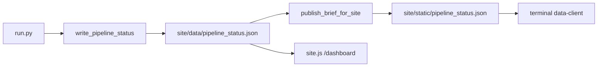

# Public shell, brief consistency, and product depth — implementation plan

**Context (from [CONTEXT.md](CONTEXT.md) + [contaxt files/PLAN.md](contaxt%20files/PLAN.md)):** Layer 3 and merge are in good shape; sprint note still says “verify CI / dashboard wiring.” This plan assumes **no change to `run.py` `STEPS` order** unless you explicitly add a new signal step (e.g. FedWatch) at the canonical end of the chain after approval.

**Today’s session deliverable (this artifact):** a single prioritized implementation plan with audit notes. **No code yet** — after approval, implementation writes mainly to `site/`, [`create_html_brief.py`](create_html_brief.py) / [`create_charts_plotly.py`](create_charts_plotly.py), [`ai_brief.py`](ai_brief.py), [`scripts/publish_brief_for_site.py`](scripts/publish_brief_for_site.py), [`core/pipeline_status.py`](core/pipeline_status.py) (only if payload contract changes), docs under `docs/` and `contaxt files/` as needed — **not** `_docs/`. Supabase changes only where justified (e.g. optional `call_time_utc` on `regime_calls`).

---

## Audit: what the repo already proves

| Claim | Verdict |
|--------|--------|
| **`pipeline_status` split** | **Confirmed.** [`core/pipeline_status.py`](core/pipeline_status.py) writes [`core/paths.py`](core/paths.py) `PIPELINE_STATUS_JSON` → `site/data/pipeline_status.json`. [`site/assets/site.js`](site/assets/site.js) loads **`/data/pipeline_status.json`**. Terminal + diagnostics use **`/static/pipeline_status.json`** ([`site/terminal/data-client.js`](site/terminal/data-client.js), [`scripts/publish_brief_for_site.py`](scripts/publish_brief_for_site.py) copies `site/data` → `site/static`). Two URLs can diverge if publish/CI skips a copy or an old `static/` file is served. |
| **Field name bug** | **Confirmed.** `FXRLTest` logs `psJson.last_run` but the writer emits **`last_run_utc`** ([`core/pipeline_status.py`](core/pipeline_status.py)), so console diagnostics are misleading. |
| **Marketing shell behind terminal** | **Confirmed.** [`site/dashboard/index.html`](site/dashboard/index.html) still states placeholders and shows **hardcoded** “Accuracy (20d): EUR/USD 68% …” ([line 44 region](site/dashboard/index.html)); [`site/index.html`](site/index.html) includes a static hero accuracy strip. Terminal uses real `validation_log` via [`site/terminal/terminal-accuracy.js`](site/terminal/terminal-accuracy.js). |
| **`macro_cal.json` unused on home** | **Confirmed** for public/terminal home; file is produced by [`macro_pipeline.py`](macro_pipeline.py), copied to `site/data/` in publish ([`_DATA_FILES`](scripts/publish_brief_for_site.py)), and used in [`create_html_brief.py`](create_html_brief.py) — not surfaced on landing/terminal home. |
| **Regime history** | **Data exists:** daily `regime_calls` upsert from [`core/regime_persist.py`](core/regime_persist.py) (`date`, `pair`, `regime`, …). No `call_time_utc` today — only calendar **`date`**. Streaks and “previous regime” are derivable from ordered history (no migration strictly required for v1). |
| **Validation pipeline** | **Confirmed:** [`validation_regime.py`](validation_regime.py) runs as `validate` step; upserts `validation_log` with `correct_1d` **null when prediction direction is NEUTRAL** (by design), which **depresses** naive “% correct” on small samples — worth explaining in UI. |
| **Dead `CME_CVOL_*` in config** | **Likely stale report:** current [`config.py`](config.py) shows CBOE/yfinance vol indices and `CME_OI_*`, not `CME_CVOL_BASE`. Do a quick grep before any “cleanup pass.” |
| **`.cursor/rules/site-rules.mdc` vs UI v2** | **Conflict:** site rules still prescribe dark navy shell; repo decision ([CONTEXT.md](CONTEXT.md), [FX-Regime-Lab-Core.mdc](.cursor/rules/FX-Regime-Lab-Core.mdc)) is **light editorial `site/`** + **dark terminal**. Updating that rule avoids future agents undoing the product direction. |

---

## Priority tiers (recommended order)

### Tier A — Credibility and “not broken” (do first)

1. **Unify `pipeline_status` consumption**  
   - **Recommendation:** treat **`/data/pipeline_status.json` as the single canonical URL** for all browser surfaces (marketing dashboard, terminal home, methodology test page).  
   - Change terminal + any `fetch('/static/pipeline_status.json')` callers to `/data/...`.  
   - **Either** stop copying status into `site/static/` **or** keep the copy as a redundant mirror only if something off-repo still needs it — document one truth in [docs/CODEBASE_AND_PROJECT_REFERENCE.md](docs/CODEBASE_AND_PROJECT_REFERENCE.md) and [docs/TERMINAL_DEEP_REFERENCE.md](docs/TERMINAL_DEEP_REFERENCE.md).  
   - Fix `FXRLTest` to read **`last_run_utc`**.  
   - **Effort:** small. **Risk:** low.

2. **Remove misleading accuracy on the light shell**  
   - Replace hardcoded dashboard bar ([`site/dashboard/index.html`](site/dashboard/index.html) ~line 44) and static hero accuracy ([`site/index.html`](site/index.html)) with either: **hidden until N≥60–90** evaluated rows per pair, **or** a short disclaimer (“Framework live from … validation accumulating; terminal shows live counts”).  
   - Optionally wire dashboard to same Supabase read pattern as terminal (reuse anon client + `validation_log`) so numbers are **real** when shown.  
   - **Effort:** small–medium. **Risk:** low.

3. **Marketing `/dashboard` (and minimally `/about`) — Phase 0 checklist**  
   - Wire pipeline timestamp via existing `FXRegimeSite.loadPipelineStatus()` + `last_run_utc`.  
   - Replace placeholder regime cards with **Supabase `regime_calls`** (same columns terminal uses), or clearly label “preview” until wired.  
   - **Effort:** medium. **Risk:** medium (RLS, env injection on Pages).

### Tier B — “Two brands in one journey” (high impact, larger effort)

4. **Plotly morning brief inside light shell**  
   - **Options (pick one primary strategy):**  
     - **B1 (full alignment):** Light Plotly template + light CSS in [`create_html_brief.py`](create_html_brief.py) / [`create_charts_plotly.py`](create_charts_plotly.py) / [`static/styles.css`](static/styles.css) so `/brief/latest.html` matches UI v2 tokens (Playfair/DM Sans, canvas-adjacent backgrounds). **Largest** effort; touches every chart.  
     - **B2 (product-framed, faster):** Keep dark Plotly but wrap `/brief/` in a **full-viewport “Research view”** chrome (dark strip, clear “leave magazine → enter desk” copy) so the inconsistency reads intentional, not accidental.  
   - **Recommendation:** ship **B2 quickly**, plan **B1** as a tracked epic.  
   - **Effort:** B2 small; B1 large. **Risk:** B1 regression on chart readability.

### Tier C — Practitioner value

5. **Regime change history**  
   - Client: fetch last ~90–120 `regime_calls` per pair, walk dates to find last label change, compute **streak days**, show “**NEUTRAL 8d · was TRENDING_SHORT**” on terminal cards and/or dashboard.  
   - Optional later: Postgres view/RPC for streak to shrink payload.  
   - **Effort:** medium. **Risk:** low.

6. **Macro “next catalyst” on home**  
   - Parse shipped [`site/data/macro_cal.json`](scripts/publish_brief_for_site.py) (array of `{date, time, country, event, impact, pairs}`): pick next **HIGH** (then MED) event after “today” from browser clock or from latest `signals` date.  
   - Add one line to [`site/index.html`](site/index.html) and terminal home ([`site/terminal/index.html`](site/terminal/index.html) + small JS).  
   - **Effort:** small. **Risk:** low (JSON already deployed).

### Tier D — Narrative and validation science

7. **Morning brief text + AI narrative**  
   - **Text path:** [`morning_brief.py`](morning_brief.py) — tighten section templates toward desk prose (fewer raw column dumps); keep `_clean_brief_text` / [`core/utils.py`](core/utils.py) as guardrails.  
   - **AI path:** [`ai_brief.py`](ai_brief.py) `build_narrative_prompt` — revise instructions: ban bullet-dumps, require **lead paragraph + 2–3 tight paragraphs per pair**, explicitly **forbid contradicting** cleaned brief while allowing **numeric enrichment**; add few-shot example JSON output.  
   - **Effort:** medium (iterate on CI output quality). **Risk:** token cost drift (still Haiku; monitor).

8. **“SSRN / OOS validation logging”**  
   - **Interpretation:** you already log predictions in **`regime_calls`** and outcomes in **`validation_log`**. Gaps are **presentation + methodology copy**, not necessarily new tables.  
   - Optional enhancement: add **`call_time_utc`** (or `persisted_at`) on `regime_calls` **only if** you need sub-daily audit — requires **DDL + Python row field**; treat as **optional** unless compliance demands it.  
   - Document in methodology page how **NEUTRAL** rows affect `correct_1d` nulls and rolling windows.

### Tier E — Cleanup and platform narrative

9. **`run_all.py`**  
   - **Recommendation:** do **not** delete immediately — add prominent **DEPRECATED** module docstring, print warning, point to `run.py`; update [AGENTS.md](AGENTS.md) / root README one-liner. Remove in a later major version if unused.  
   - **Reason:** low-risk migration for anyone with old muscle memory.

10. **GitHub Pages vs Cloudflare**  
   - **Recommendation:** keep `deploy.py` **optional** in CI (or no-op push) until you deliberately cut over — but **docs** ([AGENTS.md](AGENTS.md), [PLAN.md](contaxt%20files/PLAN.md), [PHASE0_CHECKLIST.md](docs/PHASE0_CHECKLIST.md)) should state **Cloudflare = canonical public product**; GitHub Pages = **legacy mirror** with sunset criteria (e.g. “30 clean CI days on `/brief`”).  
   - Retiring Pages is **policy + CI**, not just deleting code.

11. **FedWatch integration**  
   - **Treat as Phase 2 signal spike:** confirm **CME data terms**, stable endpoint, whether **new dependency** or raw `requests` is acceptable. New module would be **`fedwatch_pipeline.py`** (or similar) inserted **only** with explicit instruction in canonical order (typically after existing rate/vol block — **you must approve position**).  
   - **Risk:** scrape fragility; “free” ≠ stable API.

---

## What might be better than the original list

- **Accuracy:** Prefer **“show counts + disclaimer + link to methodology”** over hiding forever — builds trust with sophisticated visitors.  
- **Brief theming:** **B2 framing** delivers 80% perceived quality for ~20% of B1 effort.  
- **Regime history:** Ship **client-side streak** first; avoid premature SQL complexity.  
- **FedWatch:** Pair with **existing rate-diff narrative** in brief text; do not let it become a second product surface until the core shell is credible.

## What is potentially overkill (defer)

- **Postgres RPC for streaks** until client-side proves too heavy.  
- **`call_time_utc` on every row** unless you have a regulatory or research logging requirement.  
- **Full Plotly light restyle + FedWatch + full dashboard rewrite** in one sprint — high blast radius.

---

## Suggested execution sequence (sprints)

| Sprint | Scope |
|--------|--------|
| **Sprint 1** | Tier A (status URL unify, test fix, fake accuracy removal/gating, start dashboard wiring). |
| **Sprint 2** | Tier B2 brief framing **or** start B1 if you insist on single-brand; Tier C6 macro line. |
| **Sprint 3** | Tier C5 regime history (terminal + dashboard); Tier D7 prompt + morning_brief prose. |
| **Sprint 4** | Tier D8 methodology + validation UX; Tier E docs + `run_all` deprecation. |
| **Spike** | FedWatch: terms, endpoint, schema, **then** ask for dependency + `run.py` slot approval. |

---

## Out of scope / constraints (respect unless overridden)

- **`_docs/`** Obsidian vault — do not modify per project rules.  
- **`data/`, `briefs/`, `runs/`** — do not use as agent read sources for implementation verification.  
- **Canonical pipeline order** — no parallelization, no conditional dropping of steps.  
- **New pip packages** — FedWatch or any client library needs **explicit approval**.
