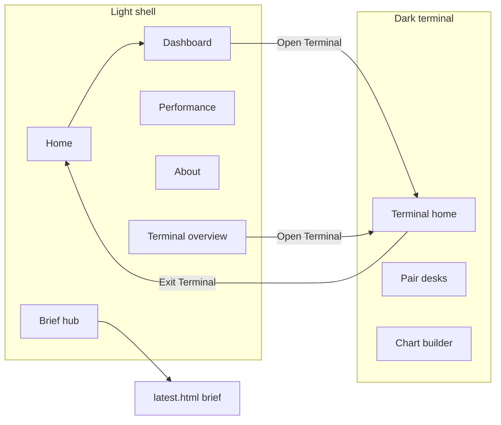

# FX Regime Lab — UI and UX deep reference (`site/` public shell)

This document describes the **complete public-site user interface and experience** for fxregimelab.com: design system (UI v2), page map, shared components, motion rules, chart-library boundaries, theme bridging to the terminal, and strengths/weaknesses. It complements the pipeline/repo map and the terminal-specific doc.

**Related:**

- Design spec and acceptance checklist: [FX_REGIME_LAB_UI_PROMPT_V2.md](./FX_REGIME_LAB_UI_PROMPT_V2.md)
- Repository and deploy: [CODEBASE_AND_PROJECT_REFERENCE.md](./CODEBASE_AND_PROJECT_REFERENCE.md)
- Pipeline orchestration and CI: [PIPELINE_AUDIT_AND_OPERATIONS.md](./PIPELINE_AUDIT_AND_OPERATIONS.md)
- Bloomberg-style terminal only: [TERMINAL_DEEP_REFERENCE.md](./TERMINAL_DEEP_REFERENCE.md)

---

## 1. Product intent (UX)

- **Positioning:** Independent macro research made public — editorial “magazine that came alive,” not a crypto dashboard, generic SaaS, or Bloomberg clone.
- **Tone:** Warm precision, calm confidence; serious typography (Playfair headlines, DM Sans body, JetBrains Mono for figures).
- **Motion:** Purposeful only — canvas ambient motion, scroll reveals, count-ups, nav blur on scroll. No parallax beyond canvas, no scroll hijack, no confetti (see §8).

---

## 2. Two visual systems (critical)

| Surface | Body class / CSS | Chart library | Notes |
|---------|------------------|---------------|--------|
| **Public shell** (`/`, `/dashboard/`, `/brief/` hub, `/performance/`, `/about/`, `/methodology/`, `/newsletter/`, `/terminal/overview.html`) | `body.theme-light`, **`site/assets/site.css`** | **Chart.js** where pages embed charts (e.g. dashboard, home) | Light magazine + canvas; nav blur **on nav only** |
| **Research terminal** (`/terminal/` except overview) | `body.theme-terminal`, **`site/terminal/terminal.css`** | **ECharts 5.4.x only** | Dark, data-dense; **never** load Chart.js here |

**Boundary rule (enforced in CSS comments):**

- `site.css` states: Chart.js on public site HTML; **ECharts must not** load on those shell pages; terminal uses ECharts only — **never Chart.js** on `/terminal/*`.

**Morning brief artifact** (`/brief/latest.html`): Generated by the Python pipeline (Plotly iframes, dark-oriented `static/styles.css`). It may **remain visually dark** until the HTML pipeline is restyled; the **hub** page around it uses the light shell. See UI Prompt v2 “conflict resolutions.”

---

## 3. Design tokens (`site/assets/site.css` `:root`)

These are the canonical **light shell** tokens (abbreviated; see file for full component rules).

| Token | Typical use |
|-------|-------------|
| `--bg-page` `#f4f5f3` | Page background |
| `--bg-surface` `#ffffff` | Cards |
| `--bg-dark` `#0f1420` | Dark “islands” / data blocks |
| `--accent` `#1b3a6b` | Navy accent / links |
| `--text`, `--text-sec`, `--text-muted` | Body hierarchy |
| `--pair-eur` `#2563a8`, `--pair-jpy` `#b86b2a`, `--pair-inr` `#a63030` | Pair accents (shell) |
| `--font-display` Playfair, `--font-body` DM Sans, `--font-mono` JetBrains Mono | Typography roles |
| `--nav-h` `68px` | Sticky nav height |
| `--max-w` `1120px` | Content max width (sections) |

**Terminal pair colors** differ slightly on dark surfaces (`terminal.css` / ECharts config); do not assume shell and terminal hex values are identical for every component.

---

## 4. Global layout pattern

Most shell pages share:

1. **Canvas background** — `<canvas id="fx-canvas-bg" aria-hidden="true">`, driven by `site/assets/canvas-bg.js` (full viewport, `pointer-events: none`, z-index under content).
2. **Wrapper** — `.v2-wrap` (z-index above canvas).
3. **Sticky nav** — `.v2-nav` with `[data-nav-root]`, desktop links `[data-path]`, mobile `[data-nav-toggle]` + full-screen `[data-nav-overlay]`.
4. **Footer** — `.v2-footer` with site links and contact.

**Scroll:** `html { scroll-behavior: smooth; }` globally in `site.css`.

---

## 5. Site map (HTML entry points)

| Path | File | Shell notes |
|------|------|-------------|
| `/` | `site/index.html` | Hero + sections; Chart.js; extra `intro.css` for intro/cinematic patterns if used |
| `/dashboard/` | `site/dashboard/index.html` | Chart.js, pipeline strip, pair cards, tabs |
| `/brief/` | `site/brief/index.html` | Brief **hub** (light shell + paper-style overrides in-page); links to latest brief |
| `/performance/` | `site/performance/index.html` | Coming-soon / roadmap framing |
| `/about/` | `site/about/index.html` | About narrative |
| `/methodology/` | `site/methodology/index.html` | Methodology |
| `/newsletter/` | `site/newsletter/index.html` | Newsletter CTA (Substack) |
| `/terminal/overview.html` | `site/terminal/overview.html` | **Light shell** explainer; links into dark terminal |
| `/terminal/*` (desk) | `site/terminal/*.html` except overview | Dark terminal — see terminal reference |

**Redirects** (`site/_redirects`): e.g. `/charts/global_workspace.html` → `/terminal/` (301); `/terminal/workspace.html` → `/terminal/chartbuilder.html` (301). Newsletter path may also be handled at the edge per hosting config; UI Prompt mentions `/newsletter` → Substack where configured.

---

## 6. Navigation and active state

**Markup pattern:** Same link set in `.v2-nav__links` and `.v2-nav__overlay` for mobile.

**Active link:** `site/assets/nav.js`:

- Normalizes paths (e.g. `/brief/index.html` → `/brief`, `/terminal/overview.html` → `/terminal/overview`).
- Adds `.is-active` to `a[data-path]` when `window.location.pathname` matches prefix rules.

**Scroll state:** After ~80px scroll, `[data-nav-root]` gets `.nav-scrolled` — background + **backdrop blur (12px)** + border/shadow (nav only, not cards).

**Mobile:** `body.nav-open` locks scroll; toggle `aria-expanded`; overlay click or link click closes menu.

---

## 7. Theme bridge (light ↔ terminal)

**File:** `site/assets/theme-switch.js` → `window.FXRLThemeSwitch`.

- **`sessionStorage` key `fxrl_theme`** — session-only (new tab starts on public light theme).
- **`applyFromUrl()`** on load: if path is under `/terminal/` (except logic uses `/terminal` prefix), applies `theme-terminal`; otherwise forces `theme-light` and clears the key.
- **`exitTerminal()`** (used by terminal header): removes terminal class, adds `theme-light`, clears key, navigates home.
- Terminal pages also load this script so refresh keeps classes consistent.

**UX implication:** Users move from **editorial light** (overview) into **dark terminal** with a deliberate mode change; “Exit Terminal” returns to the marketing shell.

---

## 8. Motion and accessibility

| Mechanism | File | Behavior |
|-----------|------|----------|
| Canvas ambient | `canvas-bg.js` | rAF layers; mobile degrades (fewer layers per UI Prompt) |
| Section reveal | `section-reveal.js` | `IntersectionObserver`, staggered cards/rows, headline/sub reveal |
| Count-up | `section-reveal.js` | `.num[data-count]` with `prefers-reduced-motion: reduce` → instant values |
| Intro / hero | `intro.js`, `intro.css` | Home-only patterns per implementation |
| Dashboard charts | inline + Chart.js | Illustrative until live series fully wired |

**Reduced motion:** `section-reveal.js` short-circuits animations and applies final classes immediately when `prefers-reduced-motion: reduce`.

**Touch:** UI Prompt requires **≥44px** touch targets on mobile nav (verify against current CSS).

---

## 9. Shared scripts (shell)

| Script | Role |
|--------|------|
| `site.js` | `window.FXRegimeSite`: `loadPipelineStatus()` fetches **`/data/pipeline_status.json`**, `formatTs()` — used by dashboard (and any page that includes it) |
| `nav.js` | Mobile menu + active link + nav scroll class |
| `theme-switch.js` | Light vs terminal body classes |
| `canvas-bg.js` | Background canvas |
| `section-reveal.js` | Scroll-driven reveals + count-ups |

**Pipeline JSON path:** All surfaces use **`/data/pipeline_status.json`** (terminal, dashboard, diagnostics). A copy under `/static/` may exist for legacy bookmarks only.

---

## 10. Key page-level UX notes

### Home (`/`)

- Large hero, regime/accuracy motifs, pair preview; Chart.js for marketing charts.
- Combined `intro.css` + `site.css` for layered hero behavior (see file for current structure).

### Dashboard (`/dashboard/`)

- **Dash bar:** pipeline timestamp from `FXRegimeSite.loadPipelineStatus()`; placeholder accuracy line in markup may be superseded by live data in future phases.
- **Chart.js** for illustrative series; copy references Phase 1 pipeline/Supabase wiring.
- **CTA:** “Open Terminal” drives users to `/terminal/`.

### Brief hub (`/brief/`)

- Light “paper” styling on the **article hub** (`/brief/index.html`); link to **`/brief/latest.html`** for the full Plotly desk brief. CI injects a **fixed “Desk view” chrome bar** on `latest.html` (see `scripts/publish_brief_for_site.py`) so the dark brief reads as an intentional research surface, not a broken theme.

### Performance / About / Methodology / Newsletter

- Editorial layouts, `page-centered` or grid patterns from `site.css`; consistent footer/nav.

### Terminal overview (`/terminal/overview.html`)

- **Same v2 nav** as the rest of the site; **no** `terminal.css` — intentional onboarding page before entering the dark app.

---

## 11. Typography rules (UX)

- **Playfair:** Headlines and display only (not body walls of text).
- **JetBrains Mono:** Numbers, pipeline times, code-like labels.
- **DM Sans:** UI and body copy.

---

## 12. Mermaid — user flow (shell vs terminal)

---

## 13. Strengths (UI/UX)

- **Coherent v2 system** — tokens, nav, footer, and motion rules are centralized in `site.css` and shared JS.
- **Clear chart boundary** — Chart.js (shell) vs ECharts (terminal) avoids bundle conflicts and keeps terminal performance predictable.
- **Progressive enhancement** — Canvas and reveals degrade with reduced motion; terminal is usable without live Supabase (CSV fallbacks per terminal doc).
- **Honest staging** — Dashboard and copy often label “Phase 1” / coming wiring — sets user expectations.

---

## 14. Weaknesses and risks (UI/UX)

| Issue | Detail |
|-------|--------|
| **Dual brief aesthetic** | Pipeline-generated `latest.html` may not match light shell until HTML pipeline CSS is unified — users see two “brands” in one journey. |
| **Legacy `/static/pipeline_status.json`** | Prefer `/data/pipeline_status.json` everywhere; static copy is optional mirror from publish. |
| **Placeholder metrics** | Dashboard may still show static accuracy strings in markup vs live API — verify before claiming live numbers in marketing. |
| **Chart.js + Plotly + ECharts** — three chart stacks across surfaces | Necessary by architecture but increases cognitive load for maintainers. |
| **Heavy home page** | Hero + canvas + Chart.js + intro assets — monitor LCP and mobile performance. |

---

## 15. Maintenance checklist (UI)

1. **New shell page:** Copy nav/footer from an existing v2 page; include `theme-light`, canvas, `site.css`, `nav.js`, `theme-switch.js` as needed; set `data-path` for every nav link.
2. **New chart on shell:** Use **Chart.js** only; do not import ECharts on `site/` marketing pages.
3. **Token changes:** Edit `:root` in `site.css` first; align `FX_REGIME_LAB_UI_PROMPT_V2.md` if the spec is canonical for design QA.
4. **Terminal-bound links:** Use `/terminal/overview.html` in the main nav when pointing to “Terminal” from the light shell (current pattern).

---

*Update this file when new shell routes are added, when the brief HTML is restyled to v2, or when pipeline status paths are unified.*
