# FX Regime Lab — Codebase and project reference

This document gives AI assistants and humans a single map of the repository: purpose, orchestration, data flow, public surfaces, Cloudflare deployment, and constraints. It is descriptive, not prescriptive; authoritative rules live in `contaxt files/CURSOR_RULES.md` and `contaxt files/PLAN.md`.

**Related:** Public-site UI v2 shell (nav, tokens, motion, theme bridge): [UI_UX_DEEP_REFERENCE.md](./UI_UX_DEEP_REFERENCE.md). Bloomberg-style terminal only (`site/terminal/`): [TERMINAL_DEEP_REFERENCE.md](./TERMINAL_DEEP_REFERENCE.md). Cloudflare: [site/CLOUDFLARE_SETUP.md](../site/CLOUDFLARE_SETUP.md).

---

## 1. Mission and disclaimers

- **Purpose:** Daily G10 FX regime research: pull public market data (FX, yields, COT, INR-related series), merge into a master dataset, render a **morning brief** (text + interactive HTML), optionally deploy static outputs.
- **Audience framing:** Documented in `contaxt files/CURSOR_RULES.md` (career, admissions, institutional credibility, future product).
- **Not investment advice:** Research and education only.

---

## 2. Repository map (high level)

| Path | Role |
|------|------|
| `run.py` | Canonical orchestrator: ordered pipeline steps (see §3). |
| `run_all.py` | Simpler alternate orchestrator + archive to `runs/`. |
| `pipeline.py` | FX + yields ETL, merge → `data/` (including merged master CSV). |
| `cot_pipeline.py` | CFTC COT → `data/`. |
| `inr_pipeline.py` | INR-specific metrics → `data/`. |
| `vol_pipeline.py`, `oi_pipeline.py`, `rr_pipeline.py` | Additional signals (some stubs per comments). |
| `morning_brief.py` | Text brief → `briefs/brief_YYYYMMDD.txt`. |
| `create_html_brief.py` | HTML brief + Plotly chart fragments → `briefs/`, `charts/`. |
| `macro_pipeline.py` | Macro helpers (e.g. economic calendar JSON). |
| `ai_brief.py` | AI regime reads → `data/` JSON consumed by site. |
| `validation_regime.py` | Regime validation step (stub/Phase 2 per `run.py` comment). |
| `deploy.py` | Copies latest brief to repo-root `index.html`, path fixes, git commit/push (GitHub Pages channel). |
| `scripts/publish_brief_for_site.py` | Syncs brief, charts, static, data → `site/` for Cloudflare. |
| `config.py` | Shared constants. |
| `core/` | `paths.py`, `utils.py`, `pipeline_status.py`, etc. |
| `site/` | Public **fxregimelab.com** static shell (UI v2 light) + **`site/terminal/`** dark terminal (exception). |
| `charts/` | Generated interactive HTML; tracked for GitHub Pages. |
| `static/` | CSS and assets referenced by briefs; mirrored under `site/static/`. |
| `pages/` | Standalone narrative HTML cards (Chart.js style), **not** the daily brief. |
| `scripts/dev/` | Phase checks, stress tests, one-off builders (`os.chdir` to repo root). |
| `workers/site-entry.js` | Cloudflare Worker: asset serving + Supabase env injection + RSS proxy. |
| `wrangler.toml` | Binds Worker to `./site` as static assets. |
| `.github/workflows/` | e.g. `daily_brief.yml` scheduled pipeline + deploy. |

There is **no** `create_dashboards.py`. Charts for the brief come from `create_html_brief.py` / `create_charts_plotly.py`.

---

## 3. Pipeline orchestration (`run.py`)

**Canonical step order** is defined only in `run.py` (do not assume `AGENTS.md` or `CURSOR_RULES.md` lists match exactly; those may omit steps like `substack`).

Current `STEPS` (name → script):

| Step | Script | Typical outputs / notes |
|------|----------|-------------------------|
| `fx` | `pipeline.py` | `data/latest.csv`, FX/yield pulls |
| `cot` | `cot_pipeline.py` | `data/cot_latest.csv` |
| `inr` | `inr_pipeline.py` | `data/inr_latest.csv` |
| `vol` | `vol_pipeline.py` | Phase 1 / stub notes in `run.py` |
| `oi` | `oi_pipeline.py` | Phase 1 / stub |
| `rr` | `rr_pipeline.py` | Synthetic RR proxy (yfinance) |
| `merge` | `pipeline.py` | Merge phase is **inside** the same script as `fx` |
| `text` | `morning_brief.py` | `briefs/brief_YYYYMMDD.txt` |
| `macro` | `macro_pipeline.py` | e.g. `data/macro_cal.json` |
| `ai` | `ai_brief.py` | AI JSON; non-blocking on failure |
| `substack` | `scripts/substack_publish.py` | Substack draft; non-blocking |
| `html` | `create_html_brief.py` | `briefs/brief_YYYYMMDD.html`, `charts/*.html` |
| `validate` | `validation_regime.py` | Non-blocking |
| `deploy` | `deploy.py` | Root `index.html` + push |

**Non-blocking steps** (`run.py`): `ai`, `macro`, `validate`, `substack` — pipeline continues if they fail.

```mermaid
flowchart LR
  subgraph etl [Data ETL]
    fx[pipeline.py fx]
    cot[cot_pipeline]
    inr[inr_pipeline]
    vol[vol_pipeline]
    oi[oi_pipeline]
    rr[rr_pipeline]
    merge[pipeline.py merge]
  end
  subgraph brief [Brief]
    text[morning_brief]
    macro[macro_pipeline]
    ai[ai_brief]
    substack[substack_publish]
    html[create_html_brief]
    validate[validation_regime]
  end
  fx --> cot --> inr --> vol --> oi --> rr --> merge
  merge --> text --> macro --> ai --> substack --> html --> validate --> deploy[deploy.py]
```

`core/pipeline_status.write_pipeline_status()` runs in the pipeline orchestration path and writes JSON consumed by the public dashboard and terminal (see §6).

---

## 4. Data artifacts (conceptual)

- **Master merged CSV:** `data/latest_with_cot.csv` — wide table used by brief generation, charts, and (after publish) the browser terminal as **published CSV** fallback.
- **Python → Supabase:** Signal rows are written via shared helpers (see `core/signal_write` patterns in skills/docs); browser reads through **PostgREST** with anon key + RLS.
- **Column mapping for the web terminal:** The `signals` table does not store every column from the master CSV. The terminal merges DB fields into CSV rows using a fixed map (`SIGNAL_TO_CSV` in `site/terminal/data-client.js`). Details: [TERMINAL_DEEP_REFERENCE.md](./TERMINAL_DEEP_REFERENCE.md).

---

## 5. Public surfaces (fxregimelab.com)

- **Marketing / UI v2 shell:** Light editorial theme — `docs/FX_REGIME_LAB_UI_PROMPT_V2.md`; fonts (Playfair, DM Sans, JetBrains Mono), canvas background on key pages. Entry: `site/index.html`, styles `site/assets/site.css`.
- **Terminal:** Dark, Bloomberg-inspired, **ECharts only** on terminal routes — see terminal reference. Not the same theme tokens as the landing shell.
- **Brief:** `site/brief/latest.html` (published from pipeline), with `site/charts/` and `site/static/` copies for same-origin embeds.
- **GitHub Pages:** Repo-root `index.html` from `deploy.py` — may lag or mirror Cloudflare; `AGENTS.md` describes fallback vs cutover.

---

## 6. Cloudflare: Worker + static assets

- **Config:** `wrangler.toml` — `main = "workers/site-entry.js"`, `[assets] directory = "./site"`.
- **Deploy:** `npx wrangler deploy` (CI: `.github/workflows/daily_brief.yml`). Comment in workflow: **not** `wrangler pages deploy`; Worker serves `site/` as assets.
- **Worker responsibilities** (`workers/site-entry.js`):
  - Serve static files via `env.ASSETS.fetch`.
  - **`GET /assets/supabase-env.js`:** Injects `window.__SUPABASE_URL__` and `window.__SUPABASE_ANON_KEY__` from Worker secrets (not committed). `Cache-Control: private, no-store`.
  - **`/api/substack-rss`:** Proxies Substack feed with cache headers.
  - **`/data/*.csv` and `/static/*.json`:** Adds CORS + short cache headers for browser fetches.

**Required Worker variables** (dashboard): `SUPABASE_URL`, `SUPABASE_ANON_KEY`. If unset, terminal JS falls back to published CSV where implemented.

---

## 7. GitHub Actions (`daily_brief.yml`)

- **Trigger:** Cron `0 23 * * *` UTC; `workflow_dispatch`.
- **Required secret:** `FRED_API_KEY` (workflow fails if missing).
- **Optional / feature secrets:** `NOTION_TOKEN`, `SUPABASE_*`, `CME_API_KEY`, `ANTHROPIC_API_KEY`, `SUBSTACK_EMAIL`, `SUBSTACK_PASSWORD`, `CLOUDFLARE_API_TOKEN`, `CLOUDFLARE_ACCOUNT_ID`.
- **Flow:** `python run.py --skip deploy` (with retry) → verify `briefs/brief_YYYYMMDD.html` → `python scripts/publish_brief_for_site.py` → `python deploy.py` → `npx wrangler deploy`.

Do **not** document or commit secret values.

---

## 8. From pipeline to `site/` (Cloudflare bundle)

`scripts/publish_brief_for_site.py`:

1. Picks latest `briefs/brief_*.html`, rewrites paths (`../charts/` → `/charts/`, etc.), writes `site/brief/latest.html`.
2. Syncs Plotly chart HTML → `site/charts/`.
3. Syncs `static/` → `site/static/`.
4. **Pipeline status:** Prefers `site/data/pipeline_status.json` (written under `site/data/` by pipeline status helper); else copies `static/pipeline_status.json` → `site/static/pipeline_status.json`. Terminal home fetches **`/static/pipeline_status.json`**.
5. Copies selected files from `data/` → `site/data/`: `latest_with_cot.csv`, `cot_latest.csv`, `inr_latest.csv`, `macro_cal.json`.
6. AI article archive logic for `ai_article.json` / manifests (see script).

---

## 9. Path constants

Use `core.paths` in Python for `ROOT`, `DATA_DIR`, `BRIEFS_DIR`, `CHARTS_DIR`, and site paths — avoids breakage when layout changes.

---

## 10. Constraints (summary)

Full detail: `contaxt files/CURSOR_RULES.md`. Short list:

- Python stack and approved libraries; no new dependencies without approval.
- Persistent writes: Supabase first, CSV fallback second (pipeline code).
- No hardcoded API keys in source; GitHub Actions / env for secrets.
- Extend `run.py` `STEPS` only with care; do not restructure without instruction.
- Public `site/` UI v2 is light editorial; pipeline/brief dark tokens remain as documented elsewhere until restyled.

---

## 11. Cross-reference

| Topic | Where |
|-------|--------|
| Shell UI/UX (site map, Chart.js vs ECharts, theme bridge) | [UI_UX_DEEP_REFERENCE.md](./UI_UX_DEEP_REFERENCE.md) |
| Terminal pages, JS modules, `FXRLData`, live prices | [TERMINAL_DEEP_REFERENCE.md](./TERMINAL_DEEP_REFERENCE.md) |
| Phase roadmap | `contaxt files/PLAN.md` |
| Human + AI map | `AGENTS.md` |
| UI v2 spec | `docs/FX_REGIME_LAB_UI_PROMPT_V2.md` |

---

*Generated as a stable reference for tooling and onboarding; update when `run.py` STEPS or deploy paths change.*
