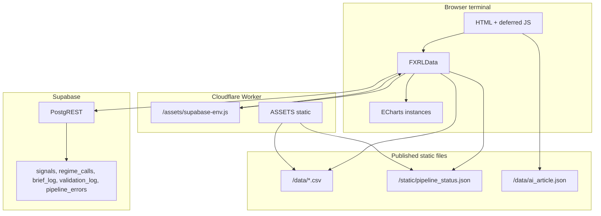

# FX Regime Lab — Terminal deep reference (`site/terminal/`)

This document describes the **internal research terminal** (Bloomberg-style dark UI, data-dense) for AI assistants and maintainers: URLs, navigation, every JS/CSS module, data sources, global APIs, strengths, weaknesses, and operational notes.

**Related:** Repository-wide pipeline and deploy — [CODEBASE_AND_PROJECT_REFERENCE.md](./CODEBASE_AND_PROJECT_REFERENCE.md). Public light shell (nav, tokens, motion) — [UI_UX_DEEP_REFERENCE.md](./UI_UX_DEEP_REFERENCE.md).

---

## 1. What the terminal is

- **Part C** of the public product: a **live workspace** on top of the same daily dataset as the morning brief (rate differentials, COT, vol, correlations, cross-asset context), organized by pair with expandable sections and charts.
- **Charting stack:** **ECharts 5.4.x only** (cdnjs). `site/assets/site.css` documents that **Chart.js must never be imported** under `/terminal/*`.
- **Contrast with the rest of the site:** Landing, dashboard, brief shell, and `overview.html` use the **UI v2 light editorial** theme (`site/assets/site.css`). Terminal pages use `body.theme-terminal` and `terminal.css` (dark tokens).
- **Not a separate SPA:** Multi-page static HTML with shared JS modules; no bundler.

---

## 2. URL map and files

| URL (typical) | File | Theme |
|---------------|------|--------|
| `/terminal/` or `/terminal/index.html` | `site/terminal/index.html` | `theme-terminal` |
| `/terminal/eurusd.html` | `site/terminal/eurusd.html` | `theme-terminal` |
| `/terminal/usdjpy.html` | `site/terminal/usdjpy.html` | `theme-terminal` |
| `/terminal/usdinr.html` | `site/terminal/usdinr.html` | `theme-terminal` |
| `/terminal/chartbuilder.html` | `site/terminal/chartbuilder.html` | `theme-terminal` |
| `/terminal/workspace.html` | `site/terminal/workspace.html` | `theme-terminal` |
| `/terminal/overview.html` | `site/terminal/overview.html` | **`theme-light`** — v2 shell only; **not** `terminal.css` |

**Asset bundle:** All terminal desk pages share `terminal.css` plus the script chain documented in §4. Pair pages add **large inline `<script>` blocks** that define chart factories and call `TerminalExpandableRows.init` / `FXRLTerminalLazy.init` with pair-specific `chartInits` maps (EUR/USD, USD/JPY, USD/INR differ by row keys and series).

---

## 3. Navigation model

### 3.1 Global header (`term-nav`)

- **Brand:** Logo + “FX Regime Lab” + product crumb “Terminal” (`index.html` structure).
- **Tabs:** Links with `class="term-nav__tab"` and **`data-path`** for active state:
  - Home: `data-path="/terminal/index"` — matches `/terminal`, `/terminal/`, `/terminal/index`.
  - Others: e.g. `data-path="/terminal/eurusd"` — substring match on normalized pathname (no `.html`).
- **Implementation:** `site/terminal/terminal-nav.js` — `syncTabActive()` on `DOMContentLoaded`.
- **Pipeline health:** Right side shows a dot + `LIVE` / `STALE` / `UNKNOWN` + timestamp string. Populated from `/static/pipeline_status.json` via `FXRLData` (`applyPipelineNavStatus`, `updatePipelineTimestamp`) on the home page; logic uses `supabase_write_status`, `last_supabase_write`, and session data date age.
- **Stale data banner:** `#term-data-stale` — shown when home init cannot get regime data from Supabase as expected.
- **Exit:** `.term-nav__exit` / `[data-term-exit]` — calls `FXRLThemeSwitch.exitTerminal()` if present, else clears `sessionStorage` theme key, removes `theme-terminal`, adds `theme-light`, navigates to `/`.

### 3.2 Skip link

- `index.html`: `<a href="#term-main" class="term-sr-only">Skip to content</a>` for accessibility.

### 3.3 Pair-page sub-nav (anchor tabs)

- **Markup:** `.term-pair-tabs` with hash links (`href="#section-id"`).
- **Behavior:** `terminal-nav.js` `initPairSubNav()` — smooth scroll, active tab underline, `IntersectionObserver` to sync active tab while scrolling; optional `section-highlight` flash on target section.

### 3.4 Site chrome elsewhere

- Main site nav (`site/assets/nav.js`) maps paths like `/terminal/overview.html` → `/terminal/overview` for active highlighting.
- Dashboard CTA links to `/terminal/` for “Open Terminal.”

---

## 4. Per-page script bundles (load order)

Scripts are **`defer`** unless noted. **Order matters:** `utils.js` → `page-init.js` → ECharts → `echarts-config.js` → `data-client.js` → …

### 4.1 Common head stack (all dark terminal pages)

1. `/assets/supabase-env.js` — **not in git**; served by Cloudflare Worker with injected globals (see §8).
2. `@supabase/supabase-js@2` UMD from jsDelivr — `async`, dispatches `supabase-ready` on load.
3. Empty `<meta name="supabase-url">` / `supabase-anon-key` — optional fallback for meta-based creds.

### 4.2 `index.html` (home)

| Order | Script |
|-------|--------|
| 1–2 | `utils.js`, `page-init.js` |
| 3 | ECharts 5.4.3 (cdnjs) |
| 4 | `echarts-config.js` |
| 5 | `data-client.js` |
| 6 | `terminal-nav.js` |
| 7 | `terminal-motion.js` |
| 8 | `home-terminal.js` |
| 9 | `live-prices.js` |
| 10 | `terminal-accuracy.js` |
| 11 | `panel.js` |
| 12 | `theme-switch.js` |

**Inline:** `DOMContentLoaded` → `FXRLPageInit.safeInit('terminal-home', bootHome)` → `FXRLData.initTerminalHome()` → delayed `checkPipelineErrors` + `FXRLTerminalAccuracy.init()`.

### 4.3 Pair pages (`eurusd.html`, `usdjpy.html`, `usdinr.html`)

Same as home except: **no** `home-terminal`, `live-prices`, `terminal-accuracy`, `panel`. **Add** `terminal-lazy-charts.js` before `terminal-motion.js`.

**Inline:** Pair-specific boot — `TerminalExpandableRows.init`, `FXRLTerminalLazy.init`, chart factories, prefetch hooks; large inline `chartInits` objects per pair.

### 4.4 `chartbuilder.html`

Loads `chart-builder.js` instead of home/pair modules; **no** `terminal-motion` / `home-terminal` / `live-prices` / `panel` / `terminal-lazy-charts`.

### 4.5 `workspace.html`

Same as chart builder **plus** `workspace.js` after `chart-builder.js`.

### 4.6 `overview.html`

**No terminal stack.** Uses `site/assets/site.css`, canvas bg, `theme-switch.js`, `nav.js`, `section-reveal.js` — marketing explainer for the terminal.

---

## 5. Module reference (by file)

### 5.1 `utils.js` → `global.FXUtils`

- `parseCSVtoTimeSeries(csvText, dateCol, valueCol)` — simple comma split (not RFC CSV).
- `formatPct`, `formatBp`, `formatSign`, `timestampToMs`.
- `getDirectionColour` — maps regime direction to CSS vars (`--bullish`, etc.).
- `debounce`.

### 5.2 `page-init.js` → `global.FXRLPageInit`

- `safeInit(name, fn)` — try/catch + promise rejection → `#term-page-error` banner.
- `showPageError(message)`.

### 5.3 `echarts-config.js`

- Palette `COL` aligned with terminal aesthetic; `TERMINAL_CHART_BASE` merged into charts.
- **Requires** global `echarts` from cdnjs **5.4.x**.
- Exports helpers (factories, `observeChartResize`, merge options) consumed by pair inline scripts and chart builder — see file for full API.

### 5.4 `data-client.js` → `global.FXRLData` (main data layer)

**Credentials:** `metaContent('supabase-url')`, `metaContent('supabase-anon-key')`, or `window.__SUPABASE_URL__` / `__SUPABASE_ANON_KEY__` from Worker script.

**Init:** `initDataClient()` — waits up to 15s for Supabase UMD + creds; `createClient` with `persistSession: false`, `autoRefreshToken: false`.

**Constants:**

- `MASTER_CSV` = `/data/latest_with_cot.csv`
- `COT_CSV` = `/data/cot_latest.csv`
- `SIGNAL_TO_CSV` — maps `signals` columns ↔ master CSV columns per pair (must stay aligned with Python `signal_write`).

**Key methods:**

| Method | Purpose |
|--------|---------|
| `fetchSignals`, `fetchSignalRows`, `fetchFromSupabase`, `fetchFromCSV` | Time series for charts; pagination + timeouts for Supabase |
| `loadData`, `loadPairDataset` | Higher-level load with **source** `supabase` / `csv` / `hybrid` / `none` |
| `patchMasterRowsFromSignals`, `buildMasterRowsFromSignals` | Merge DB rows into CSV-shaped rows |
| `fetchRegimeCalls(pair, days)` | `regime_calls` for home cards |
| `fetchLatestBrief`, `fetchBriefPreview` | `brief_log` text for home preview |
| `fetchValidationLog(pair, days)` | Rolling validation for accuracy strip |
| `checkPipelineErrors` | Reads `pipeline_errors` for console / UX |
| `fetchLatestPrices` | Latest spot bundle from merged data |
| `buildCotArraysFromSignals` | COT series from signals when CSV incomplete |
| `showPairDataStatus(source, date, root, meta)` | Updates `.pair-data-status` (Live / Published / hybrid) |
| `initTerminalHome` | Full home: skeleton, pipeline JSON, regime cards, brief, AI, stale flags |
| `formatDriverLabel`, `formatRegimeLabel`, `confidenceToPercent` | UI formatting |
| `cleanBriefText` | Strip markdown for plain preview |
| `setDataDate` / `getDataDate` | `sessionStorage` for data date line |

**Test hook:** `global.FXRLTest.testDataPath()` — console diagnostics for Supabase + CSV + pipeline_status.

---

### 5.5 `terminal-nav.js`

- `leaveTerminal`, `syncTabActive`, `initPairSubNav`, `hydrateTerminalBrand` (logo + wordmark fallback SVG).

### 5.6 `terminal-motion.js` → `global.FXRLTerminalMotion`

- `animateNumbers(root)` — count-up on numeric nodes.
- `initPageMotion` — section entrance (`IntersectionObserver`), sticky pair head (`is-compact`), `will-change` cleanup.
- Used by `panel.js` when opening slide panel.

### 5.7 `home-terminal.js`

- `MutationObserver` on `.term-card` to sync `data-panel-*` attributes for the panel.
- Fetches `/data/ai_article.json` → `global.FXRLHomeIntel`; applies drivers to cards; **intel bar** “WHAT CHANGED TODAY” from `sections.signal_changes` when article date is today.

### 5.8 `live-prices.js`

- Polls **Yahoo Finance** chart API (`query1` / `query2`) for DXY, EUR/USD, USD/JPY, USD/INR, Brent, Gold symbols.
- **FX fallback:** Frankfurter API for pairs if Yahoo fails.
- Updates `.term-card` spot meta and `.term-ticker` / `[data-term-ticker]` (min interval 30s).
- **Third-party dependency:** Subject to Yahoo/Frankfurter availability and CORS from the browser (Yahoo often works from user browsers).

### 5.9 `terminal-accuracy.js` → `global.FXRLTerminalAccuracy`

- `init()` — after `initDataClient`, loads `validation_log` for 20- and 500-day windows per pair; updates `.term-accuracy-item__pct` and total label.

### 5.10 `panel.js`

- Slide-out **pair panel** on `.term-card` click: overlay + aside.
- Uses `FXRLHomeIntel` for narrative, `FXRLData.formatDriverLabel` for drivers.
- **Quick price chart:** fetches `/data/latest_with_cot.csv`, last 30 rows of pair column (`EURUSD` / `USDJPY` / `USDINR`), ECharts line spark.

### 5.11 `terminal-lazy-charts.js` → `global.FXRLTerminalLazy`

- `init(root, { chartInits })` — `IntersectionObserver` on `[data-row-key]`: init chart when scrolled in, **dispose** when out of view (memory); empty-state message if no series.
- `attachRegimeZoneToggle` — checkbox + `localStorage` for regime direction overlay on charts.

### 5.12 `expandable-rows.js` → `global.TerminalExpandableRows`

- Single-open accordion for rows `[data-term-acc-row]`; height animation; on expand runs chart factory from `chartInits[key]`; coordinates with lazy charts on pair pages.
- `attachRegimeZoneToggle` duplicate API for accordion context (see file).

### 5.13 `chart-builder.js` → `global.FXRLChartBuilder`

- Series catalog, composer, **PNG export**, Quick Charts (localStorage), dark/light theme toggle for builder UI.
- **Duplicates** `SIGNAL_TO_CSV` mapping (must match `data-client.js`).
- Prefetch pairs for snappier UX.

### 5.14 `workspace.js`

- **Analysis workspace** — multi-series exploration using catalog from chart builder; localStorage for markers/reflines; rolling vol helper; **exploration only, no export** per file header.

### 5.15 `terminal.css`

- Terminal-only tokens: `--bg-terminal`, pair accents (EUR/USD, USD/JPY, USD/INR), monospace labels, nav, cards, accordion, panel, magazine sections, skeleton pulse, accuracy strip, chart builder layout, workspace, reduced-motion considerations.
- File header notes **AA contrast** intent for UI copy.

---

## 6. Supabase tables (browser read path)

PostgREST via `@supabase/supabase-js`; **anon key**; RLS expected on public reads.

| Table | Role in terminal |
|-------|------------------|
| `signals` | Daily signal columns; drives charts when not using CSV-only path |
| `regime_calls` | Home cards: regime, confidence, primary_driver |
| `brief_log` | Optional text brief preview on home |
| `validation_log` | Accuracy strip (`correct_1d`, etc.) |
| `pipeline_errors` | `checkPipelineErrors` diagnostics |

---

## 7. Static files consumed by terminal (HTTP)

| Path | Role |
|------|------|
| `/data/latest_with_cot.csv` | Master merged dataset (published by `publish_brief_for_site.py`) |
| `/data/cot_latest.csv` | COT slice |
| `/data/inr_latest.csv` | INR slice |
| `/data/macro_cal.json` | Macro calendar |
| `/data/ai_article.json` | AI article JSON for home intel + panel |
| `/static/pipeline_status.json` | Pipeline last run + Supabase sync metadata (copy precedence: `site/data` → `site/static` in publish script) |

Worker adds CORS headers for `/data/*.csv` and `/static/*.json` where implemented.

---

## 8. Cloudflare Worker and `supabase-env.js`

- **Source of truth:** `workers/site-entry.js`.
- **`/assets/supabase-env.js`:** Dynamic JS setting `window.__SUPABASE_URL__` and `window.__SUPABASE_ANON_KEY__` from Worker env (not stored in repo).
- **Local dev:** Without the Worker, the script may 404 or return empty — terminal falls back to **published CSV** for many flows; **regime cards** need Supabase for full `regime_calls` data.

---

## 9. External dependencies (CDN / APIs)

| Dependency | Use |
|------------|-----|
| jsDelivr `@supabase/supabase-js@2` UMD | Supabase client |
| cdnjs ECharts **5.4.3** | All terminal charts |
| Google Fonts | Inter, JetBrains Mono, Playfair (pages vary) |
| Yahoo Finance `v8/finance/chart` | Live ticker / card prices |
| Frankfurter | FX spot fallback |
| Supabase REST | PostgREST queries |

---

## 10. Data flow (mermaid)

**Merge strategy:** `loadPairDataset` chooses **supabase**, **csv**, **hybrid**, or **none** depending on client availability and fetch success; UI shows `.pair-data-status` via `showPairDataStatus`.

---

## 11. Feature checklist (home)

- Regime **cards** for EUR/USD, USD/JPY, USD/INR with confidence, driver, badge.
- **Intel bar** (“What changed today”) from AI JSON when dated today.
- **Macro ticker** row with live prices (Yahoo/Frankfurter).
- **Slide panel** with narrative, signal table, changes list, 30-day spark chart.
- **Brief preview** card: `brief_log` text, else AI `macro_context` / headline, else placeholder.
- **Accuracy strip** from `validation_log`.
- **Pipeline health** line + stale banner when appropriate.
- **10s init timeout** with full-screen error + reload button (inline script in `index.html`).

---

## 12. Strengths

- **No build step** — easy to edit and deploy static assets.
- **Graceful degradation** — CSV fallback when Supabase unavailable; hybrid merge for column coverage.
- **Secrets not in repo** — Worker injects anon key; RLS is the control plane.
- **Performance** — Lazy chart init/dispose on pair pages; accordion limits open charts.
- **Operational visibility** — `pipeline_status.json`, `pipeline_errors`, `FXRLTest.testDataPath()`.
- **Accessibility** — Skip link, ARIA on panels, reduced-motion path in `terminal-motion`.

---

## 13. Weaknesses and risks

| Risk | Detail |
|------|--------|
| **Duplicated mappings** | `SIGNAL_TO_CSV` exists in both `data-client.js` and `chart-builder.js` — must stay in sync with Python `signal_write` and master CSV. |
| **Large CSV in browser** | Full-file fetch/parse for some paths (panel spark, chart builder) — memory and CPU on slow devices. |
| **Live prices** | Yahoo/Frankfurter are unofficial consumer endpoints; rate limits, shape changes, or CORS issues can break ticker without affecting pipeline CSVs. |
| **No SSR** | All rendering client-side; SEO for terminal pages is weak by design. |
| **Pair page complexity** | Chart factories live in **inline scripts** per HTML — harder to lint and reuse than modules. |
| **Local dev** | `supabase-env.js` 404 or empty → reduced functionality unless meta/globals set manually. |
| **Two overview entry points** | `overview.html` is light v2; main terminal is dark — users may confuse marketing vs app. |

---

## 14. Maintenance checklist for AI / humans

1. When adding a **signal column** to Supabase + pipeline: update Python `signal_write` mapping, **`SIGNAL_TO_CSV` in both JS files**, and any pair inline chart series.
2. When changing **pipeline** steps: update `CODEBASE_AND_PROJECT_REFERENCE.md` and `run.py` (canonical).
3. When changing **Worker** routes or secrets: update `workers/site-entry.js` and [site/CLOUDFLARE_SETUP.md](../site/CLOUDFLARE_SETUP.md).
4. **Never** add Chart.js to `/terminal/*`.

---

*This file is a living reference; update when new terminal scripts or HTML pages are added.*
